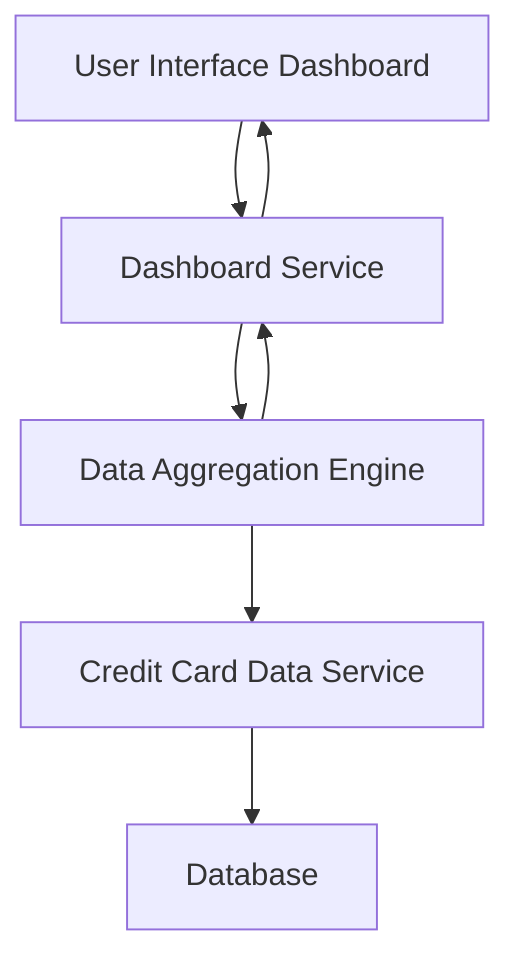

#### 1. High-Level Design

- **Summary**: This epic delivers a unified dashboard interface that consolidates key performance indicators for users' credit card portfolios. The solution aggregates data from multiple credit cards to display monthly spend, total credit limit, available credit, and outstanding amounts, providing users with a comprehensive snapshot of their credit card financial health.

- **Component Flow**:

- **Integration Points**: 
  - **Upstream**: Credit Card Data Service (retrieves card details, balances, and limits)
  - **Downstream**: User Interface (web/mobile clients consuming dashboard data)
  - Data aggregation engine for consolidating multi-card information

- **Key Assumptions**: 
  - Credit card data is refreshed at regular intervals (assumed daily or near-real-time) from the Credit Card Data Service
  - All credit cards associated with a user are identifiable through a common user identifier in the data service

- **NFR Highlights**: System must support responsive layouts across devices; Dashboard must load within acceptable performance thresholds for real-time financial data display

- **Data Flow**: User requests dashboard view → Dashboard Service queries Data Aggregation Engine → Aggregation Engine retrieves card details, balances, and limits from Credit Card Data Service → Data Service fetches from Database → Aggregated KPIs (monthly spend, total credit limit, available credit, outstanding amounts) are calculated → Results returned to Dashboard Service → Dashboard UI renders consolidated multi-card view with all KPIs displayed responsively

#### 2. Validation Report

- **Requirements Coverage**: The design fully covers the epic's stated scope including dashboard KPIs display, monthly spend tracking, total credit limit aggregation, available credit calculation, outstanding amount monitoring, multiple credit card view, and consolidated interface. The component architecture supports responsive layouts and real-time data display as specified in NFRs. Integration with the Credit Card Data Service satisfies the stated dependency requirement.