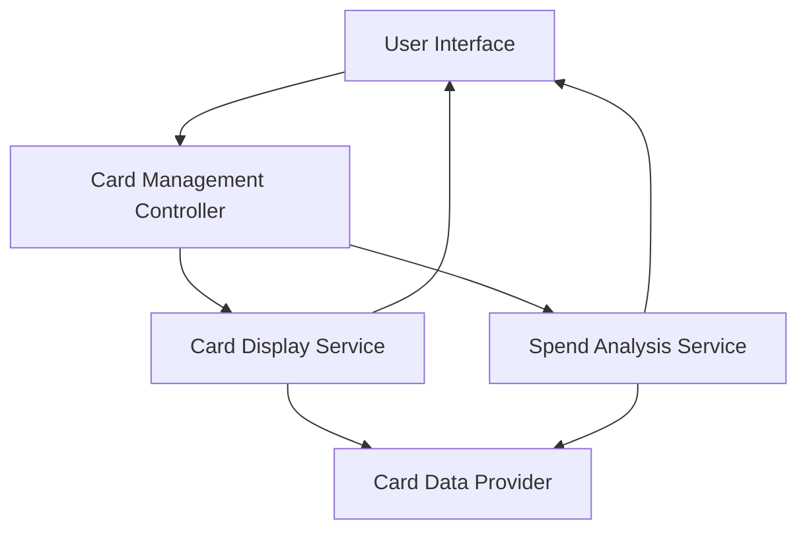

#### 1. High-Level Design

**Summary:** This epic enables users to manage and view multiple credit cards within the dashboard, providing a consolidated view with card-specific details and card-wise spend analysis. Users can select, filter, and compare individual card metrics to optimize credit card usage strategy.

**Component Flow:**

**Integration Points:**
- **Upstream:** Credit card data provider or mock service for card information, card branding, and card-specific transaction data
- **Downstream:** UI components for card display, filtering, and selection

**Key Assumptions:**
- Card data includes metadata such as card type, issuer branding, and last four digits for display purposes
- Spend analysis is calculated on-demand or pre-aggregated at the card level with daily granularity

**NFR Highlights:** System must handle display of multiple credit cards efficiently; Card data must be presented in a user-friendly, scannable format; Interface must maintain performance with increasing number of cards

#### 2. Validation Report

**Requirements Coverage:** The design addresses all scope elements including multiple credit card display, card-wise spend analysis, card details view, card selection and filtering, and individual card metrics. The separation of Card Display Service and Spend Analysis Service ensures efficient handling of multiple cards.

**Traceability:** NFRs for efficient multi-card display, user-friendly presentation, and performance scalability are supported through dedicated services and optimized data retrieval patterns. Dependencies on card data provider are clearly mapped.

**Gaps/Risks:** None identified. The epic explicitly excludes real bank integration, payments, transfers, and card application processes.