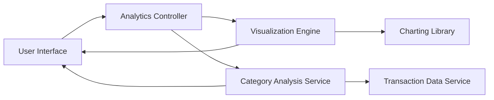

#### 1. High-Level Design

**Summary:** This epic provides interactive visualizations and analytics capabilities to help users understand spending behavior through monthly spend trends and category-wise spending analysis across 9 predefined categories (Food & Dining, Fuel, Shopping, Travel, Entertainment, Utilities, Healthcare, Education, Miscellaneous). The analytics deliver actionable insights for better budgeting and financial decision-making.

**Component Flow:**

**Integration Points:**
- **Upstream:** Transaction data service or mock data provider for categorized transaction history
- **Downstream:** Charting libraries (e.g., Chart.js, D3.js) for visualization rendering
- **Internal:** Category Analysis Service for transaction categorization into 9 predefined categories

**Key Assumptions:**
- Transactions are pre-categorized by the transaction data service or categorized on-the-fly using rule-based logic
- Monthly spend trends are aggregated at the month level with historical data available for at least 12 months

**NFR Highlights:** Visualizations must be interactive and responsive; Analytics processing must complete within acceptable time limits; Charts must render efficiently with large transaction datasets

#### 2. Validation Report

**Requirements Coverage:** The design covers all scope elements including monthly spend trends visualization, category-wise spending analysis, interactive charts and graphs, spending pattern identification, and transaction categorization across 9 predefined categories. The Visualization Engine and Category Analysis Service provide the necessary analytics capabilities.

**Traceability:** NFRs for interactive and responsive visualizations, acceptable processing time, and efficient rendering with large datasets are addressed through the Visualization Engine, charting library integration, and optimized data aggregation in the Category Analysis Service.

**Gaps/Risks:** None identified. The epic explicitly excludes real bank integration, payments, transfers, predictive analytics, and budget recommendations.