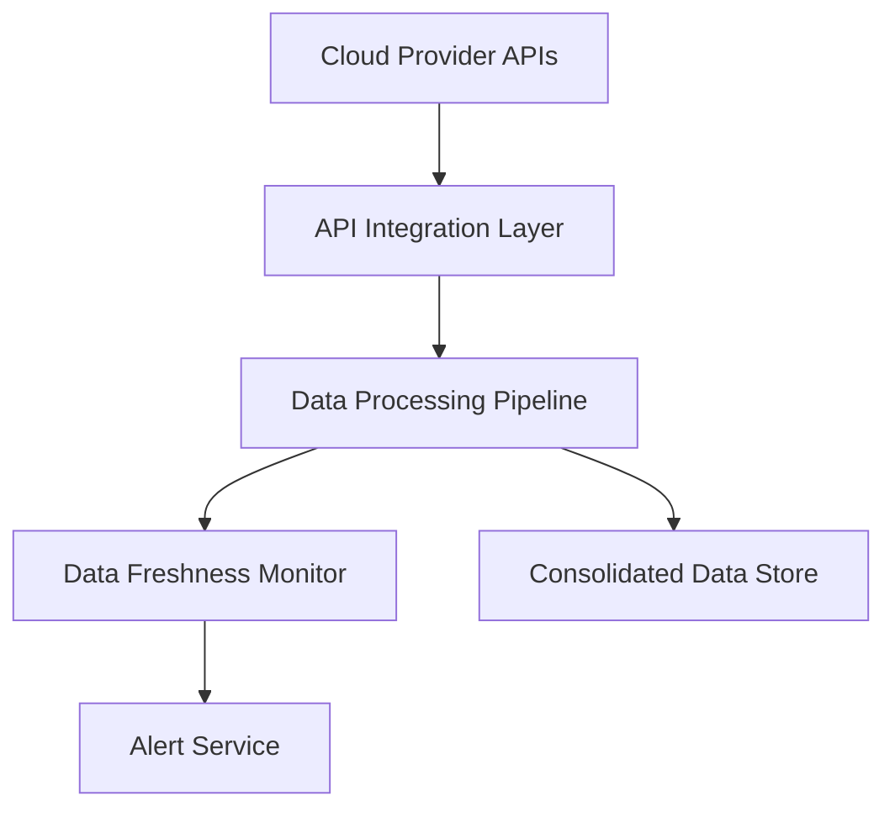

#### 1. High-Level Design

- **Summary**: This epic establishes automated data collection and aggregation infrastructure to gather AI usage and spend data from AWS, Azure, and GCP cloud providers across all portfolio companies. The system provides real-time data processing, freshness monitoring, and automated alerts for missing or outdated data, delivering a consolidated portfolio-wide view of AI investments.

- **Component Flow**:

- **Integration Points**: 
  - Upstream: AWS, Azure, and GCP cloud provider APIs for AI service usage and cost data
  - Downstream: Consolidated data store for analytics and reporting components
  - External: Portfolio companies' cloud provider API access and permissions
  - Infrastructure: Automated failover and backup infrastructure

- **Key Assumptions**: 
  - Portfolio companies will grant API access with sufficient permissions to read AI service usage and billing data
  - Cloud provider APIs will return data in standardized JSON format with consistent schema across providers

- **NFR Highlights**: Dashboard loads within 3 seconds for 95% of interactions with up to 50 portfolio companies; supports up to 200 portfolio companies and 1,000 concurrent users; 99.5% uptime with automated failover; data encryption using TLS 1.2+ and AES-256; 24-hour data freshness for 95% of companies

#### 2. Validation Report

- **Requirements Coverage**: The design addresses all core requirements including secure API integrations with three major cloud providers, real-time data processing pipeline, data freshness monitoring with 24-hour threshold, automated alert notifications, and consolidated portfolio-wide data view. The architecture supports the stated NFRs for performance (3-second load time), scale (200 companies, 1,000 users), security (TLS 1.2+, AES-256), and reliability (99.5% uptime).

- **Gap Analysis**: No significant gaps identified. The epic clearly defines scope, NFRs, dependencies, and exclusions. The design covers automated data collection, aggregation, synchronization, monitoring, and alerting as specified.

- **Risk Assessment**: 
  - **High Risk**: Dependency on portfolio companies granting API access and maintaining valid credentials; potential API rate limits or throttling from cloud providers affecting real-time data collection
  - **Medium Risk**: Handling schema changes or API version updates from cloud providers; ensuring consistent data quality across heterogeneous cloud environments
  - **Mitigation**: Implement retry logic with exponential backoff, credential validation workflows, API version monitoring, and schema validation with graceful degradation