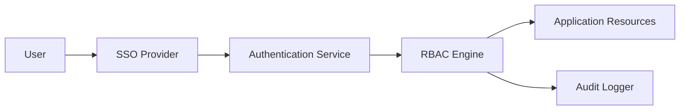

#### 1. High-Level Design

- **Summary**: This epic implements comprehensive security infrastructure including role-based access control (RBAC), SSO authentication, user permission management, audit logging, and encryption. Enterprise Admins can manage user permissions by company and role, configure security policies, and maintain compliance through comprehensive audit trails and security monitoring.

- **Component Flow**:

- **Integration Points**: 
  - Upstream: Existing SSO provider for user authentication
  - External: Email service for user notifications and password resets
  - Infrastructure: Audit logging infrastructure for compliance and security monitoring
  - Downstream: All application resources requiring access control

- **Key Assumptions**: 
  - Organization has an existing SSO provider (e.g., Okta, Azure AD) that supports standard protocols (SAML 2.0 or OAuth 2.0)
  - User roles and permissions can be mapped to portfolio company structure with hierarchical access patterns

- **NFR Highlights**: All data encrypted using TLS 1.2+ (transit) and AES-256 (rest); supports 1,000 concurrent users; user lockout recovery emails within 2 minutes; WCAG 2.1 AA accessibility compliance; mandatory RBAC and audit logging for all access attempts

#### 2. Validation Report

- **Requirements Coverage**: The design fully addresses security requirements including RBAC by user and company, SSO integration, permission assignment/revocation, comprehensive audit logging, user lockout/recovery mechanisms, encryption standards, and security monitoring. The architecture meets all stated NFRs for security, concurrency, response time, and accessibility.

- **Gap Analysis**: No critical gaps. The epic clearly defines security scope and compliance requirements. One minor consideration: the epic excludes MFA in initial release, which may be required for certain compliance frameworks, but this is explicitly marked as out of scope.

- **Risk Assessment**: 
  - **High Risk**: SSO provider outages could block all user access; improper permission configuration could expose sensitive portfolio data
  - **Medium Risk**: Audit log storage growth over time; ensuring WCAG 2.1 AA compliance across all UI components
  - **Mitigation**: Implement SSO failover mechanisms or emergency access procedures; automated permission validation and least-privilege defaults; log rotation and archival policies; accessibility testing integrated into development workflow