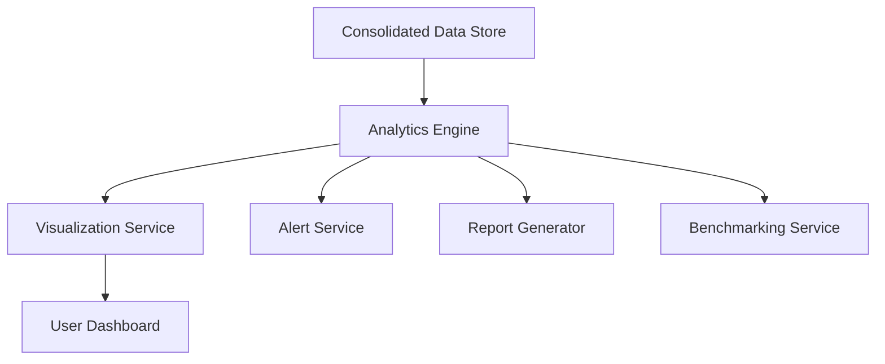

#### 1. High-Level Design

- **Summary**: This epic delivers comprehensive analytics, visualization, and reporting capabilities enabling stakeholders to monitor AI adoption, identify cost-saving opportunities, and make strategic decisions. The system provides customizable dashboards with real-time portfolio views, drill-down analytics, automated budget alerts, benchmarking tools, report generation (PDF/Excel), AI-driven cost optimization recommendations, and cost savings simulation tools.

- **Component Flow**:

- **Integration Points**: 
  - Upstream: Data aggregation pipeline from Epic 1 (QE-4366) for consolidated AI usage and spend data
  - Upstream: User authentication and access control from Epic 2 (QE-4367) for secure data access
  - External: Report generation service for PDF and Excel export
  - External: Email/notification service for automated alerts
  - External: Benchmarking data sources for industry averages and cross-company comparisons

- **Key Assumptions**: 
  - Industry benchmarking data will be available from third-party providers or can be derived from anonymized portfolio company data
  - Budget thresholds and alert rules will be configurable per company with reasonable defaults provided

- **NFR Highlights**: Dashboard loads within 3 seconds for 95% of interactions; alerts sent within 5 minutes of threshold breach; reports generated within 10 seconds; minimum 1 actionable cost-saving recommendation per company per quarter; 80% Operating Partner adoption within 6 months post-launch

#### 2. Validation Report

- **Requirements Coverage**: The design comprehensively addresses all analytics and reporting requirements including real-time consolidated dashboards, customizable widgets, drill-down analytics by company/department/project, automated budget alerts, benchmarking tools, multi-format report export, AI-driven recommendations, cost simulation scenarios, and executive summaries. All performance NFRs are explicitly addressed in the architecture.

- **Gap Analysis**: No significant gaps identified. The epic has clear dependencies on Epics 1 and 2, which provide the necessary data pipeline and security infrastructure. The exclusion of advanced predictive analytics and ML models in the initial release is explicitly documented as out of scope.

- **Risk Assessment**: 
  - **High Risk**: Achieving 80% Operating Partner adoption target within 6 months requires strong user experience and change management; delivering actionable cost-saving recommendations requires sophisticated analysis algorithms
  - **Medium Risk**: Dashboard performance with large datasets (200 companies); ensuring alert accuracy to avoid alert fatigue
  - **Mitigation**: Implement data caching and query optimization; conduct user research and iterative UX testing; develop recommendation engine with domain expert validation; implement alert threshold tuning and aggregation strategies; establish user onboarding and training programs