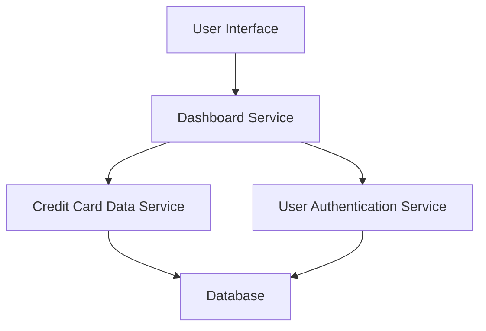

#### 1. High-Level Design

- **Summary**: This epic enables users to view a consolidated dashboard displaying key performance indicators (KPIs) for all credit cards in a single interface, including monthly spending, total credit limits, available credit, and outstanding amounts with real-time visibility for informed financial decisions.

- **Component Flow**:

- **Integration Points**: 
  - Upstream: Credit Card Data Service (retrieves card information and balances)
  - Upstream: User Authentication Service (provides secure access control)

- **Key Assumptions**: 
  - KPI calculations (available credit, outstanding amounts) are performed in real-time or near real-time by Credit Card Data Service
  - Dashboard supports responsive breakpoints for mobile (320px+), tablet (768px+), and desktop (1024px+) devices

- **NFR Highlights**: Dashboard must load within 2 seconds, support responsive design across desktop and mobile devices, provide real-time data refresh capability

- **Data Flow**: User logs in via User Authentication Service → Dashboard Service authenticates user session → Service queries Credit Card Data Service for all cards associated with user → Service aggregates KPIs (monthly spend, total credit limit, available credit, outstanding amounts) across all cards → Aggregated metrics are returned to UI → Dashboard renders responsive layout with KPI widgets → Real-time refresh updates data without full page reload

#### 2. Validation Report

- **Requirements Coverage**: The design covers all stated scope items including dashboard KPIs display, monthly spend tracking, total credit limit aggregation, available credit calculation, outstanding amount monitoring, multiple credit card view, and responsive layout design. The architecture supports the NFRs for 2-second load time through optimized service calls, responsive design across devices through adaptive UI components, and real-time refresh capability through periodic polling or WebSocket connections.