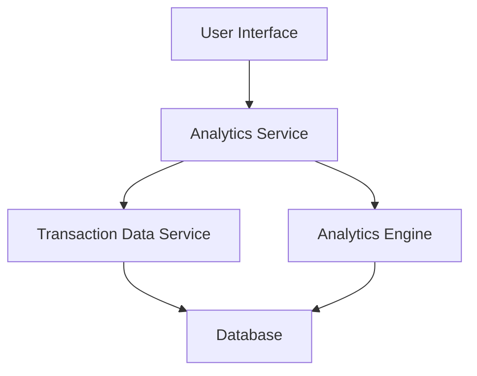

#### 1. High-Level Design

- **Summary**: This epic delivers interactive analytics capabilities allowing users to understand spending patterns through visual representations, including monthly spend trends, category-wise spending across nine predefined categories, and card-wise spend comparison to optimize expenses.

- **Component Flow**:

- **Integration Points**: 
  - Upstream: Transaction Data Service (provides spending history)
  - Upstream: Analytics Engine (performs data aggregation and categorization)

- **Key Assumptions**: 
  - Historical data is retained for at least 12 months in the system
  - Charts will use standard visualization library (e.g., Chart.js, D3.js) with drill-down capability on category/card selection

- **NFR Highlights**: Analytics visualizations must render within 3 seconds, handle up to 12 months of historical transaction data, charts must be interactive with drill-down capabilities

- **Data Flow**: User accesses analytics dashboard → Analytics Service requests historical transaction data from Transaction Data Service → Analytics Engine aggregates data by month, category, and card → Processed data is formatted for visualization → UI renders interactive charts showing monthly trends, category breakdowns, and card-wise comparisons → User can drill down into specific categories or time periods

#### 2. Validation Report

- **Requirements Coverage**: The design covers all stated scope items including monthly spend trend visualization, category-wise spending analysis across nine categories, card-wise spend comparison, interactive charts, and historical data display. The architecture supports the NFRs for 3-second rendering, 12-month data handling, and interactive drill-down capabilities through dedicated Analytics Engine and optimized data aggregation.