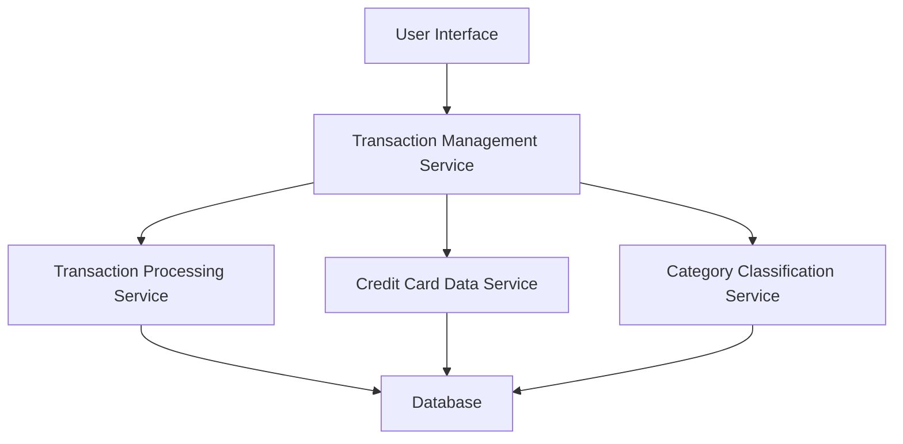

#### 1. High-Level Design

- **Summary**: This epic provides comprehensive transaction viewing and credit card management capabilities, enabling users to view detailed transaction histories (dates, amounts, merchants, categories) for each credit card and manage their card portfolio with complete transparency into usage and charges.

- **Component Flow**:

- **Integration Points**: 
  - Upstream: Transaction Processing Service (provides transaction data)
  - Upstream: Credit Card Data Service (provides card details)
  - Upstream: Category Classification Service (provides automatic transaction categorization)

- **Key Assumptions**: 
  - Transaction data is available in a standardized format from the Transaction Processing Service
  - Pagination will use cursor-based or offset-based approach with default page size of 50 transactions

- **NFR Highlights**: Must support pagination for large datasets, display up to 1000 transactions per card efficiently, ensure transaction data accuracy and consistency with card statements

- **Data Flow**: User requests transaction list → Transaction Management Service queries Transaction Processing Service for transaction data → Service retrieves card details from Credit Card Data Service → Category Classification Service enriches transactions with categories → Aggregated data is returned to UI with pagination support → User can filter by card, search, and sort transactions

#### 2. Validation Report

- **Requirements Coverage**: The design covers all stated scope items including transaction list view, transaction details display, card information management, transaction categorization, multi-card filtering, and search/sort functionality. The architecture supports the NFRs for pagination, 1000 transaction display capacity, and data accuracy through direct integration with authoritative data services.