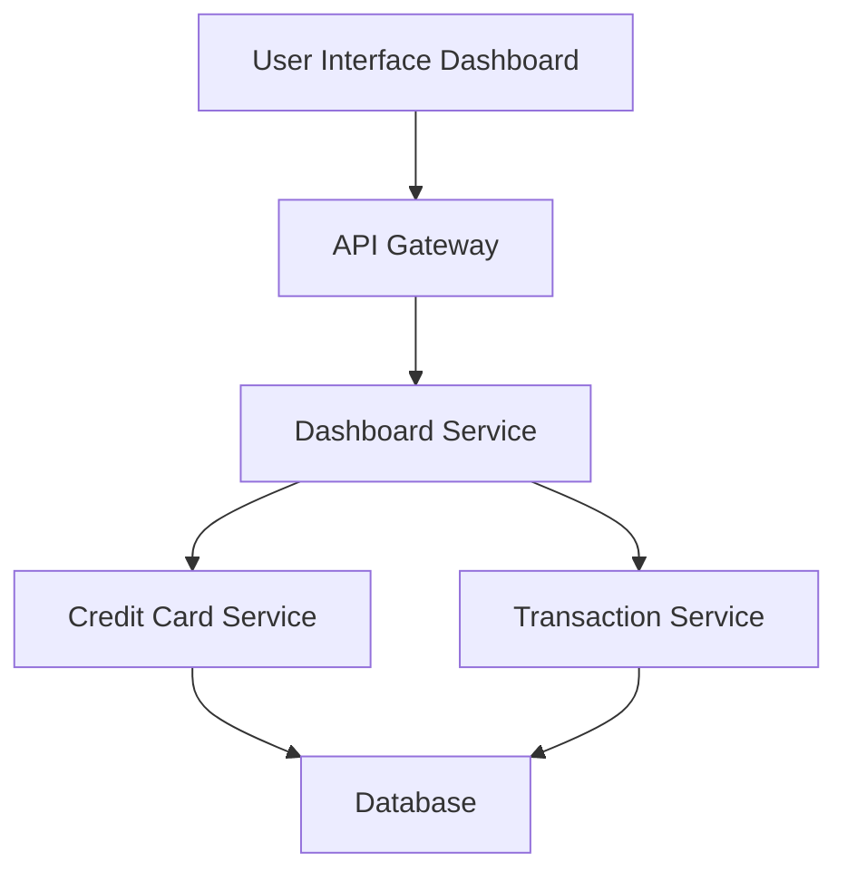

#### 1. High-Level Design

- **Summary:** This epic delivers a consolidated dashboard that displays all user credit cards with key performance indicators (KPIs) including monthly spend, total credit limit, available credit, and outstanding amounts. The dashboard provides a unified view for monitoring multiple credit cards and assessing overall financial health.

- **Component Flow:**

- **Integration Points:** 
  - **Upstream:** Credit Card Service (for card details and balances), Transaction Service (for spending data)
  - **Downstream:** User Interface (web/mobile responsive clients)

- **Key Assumptions:** 
  - Credit Card Service provides real-time or near-real-time balance data via REST API
  - Monthly spend is calculated as sum of transactions within current calendar month

- **NFR Highlights:** Dashboard must load within 2 seconds, support responsive design for mobile and desktop, handle up to 20 credit cards per user

#### 2. Validation Report

- **Requirements Coverage:** The design addresses all stated scope items including KPI display, multiple card view, monthly spend tracking, credit limit aggregation, available credit calculation, outstanding amount monitoring, and responsive layout. The component flow shows clear integration with required upstream services.

- **Completeness Assessment:** Requirements are well-defined with clear NFRs for performance (2-second load time) and scale (20 cards per user). The epic explicitly defines what is out of scope (real bank integration, payments, transfers, loans), reducing ambiguity.

- **Risks and Gaps:** 
  - No specification on data refresh frequency or caching strategy to meet 2-second load time
  - Credit utilization calculation logic not explicitly defined (assumed: outstanding/limit ratio)
  - Error handling strategy for service unavailability not specified