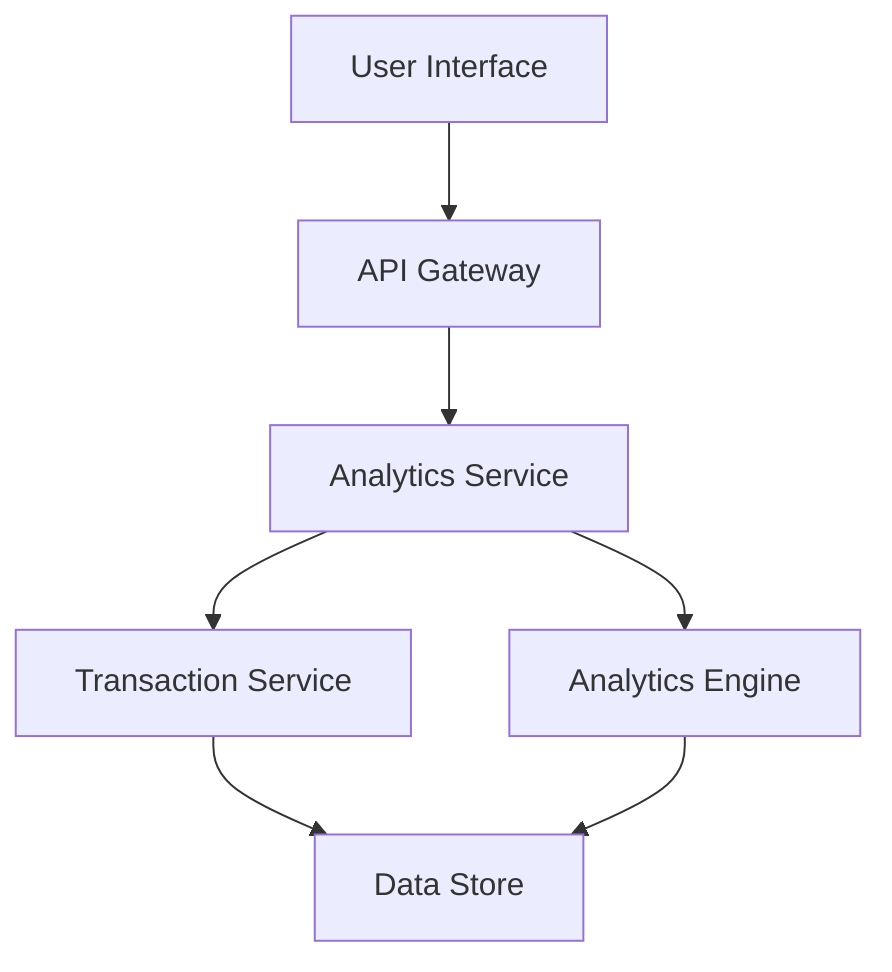

#### 1. High-Level Design

- **Summary:** This epic provides interactive analytics and visualizations for understanding spending behavior through category-wise breakdowns and monthly trends. Users can analyze spending across 9 predefined categories (Food & Dining, Fuel, Shopping, Travel, Entertainment, Utilities, Healthcare, Education, Miscellaneous) to support budget management and financial planning.

- **Component Flow:**

- **Integration Points:**
  - **Upstream:** Transaction Service (for transaction data), Analytics Engine (for data aggregation and processing)
  - **Downstream:** User Interface with interactive charts and graphs

- **Key Assumptions:**
  - Transactions are pre-categorized by Transaction Service or categorization logic exists in Analytics Engine
  - Historical data is retained for at least 12 months for trend analysis

- **NFR Highlights:** Analytics queries must execute within 3 seconds, support data visualization for up to 12 months of historical data, charts must be interactive and responsive

#### 2. Validation Report

- **Requirements Coverage:** The design covers all scope elements including category-wise visualization, monthly trend analysis, card-wise spend analysis, interactive charts, and spending pattern identification across 9 categories. Integration with Transaction Service and Analytics Engine is clearly mapped.

- **Completeness Assessment:** Requirements include specific NFRs for query performance (3 seconds) and data retention (12 months). The 9 spending categories are explicitly enumerated, providing clear boundaries. Out-of-scope items are well-defined.

- **Risks and Gaps:**
  - Transaction categorization mechanism not specified (manual vs automated vs ML-based)
  - Chart library or visualization technology not defined
  - Data aggregation strategy (real-time vs batch) not specified for meeting 3-second query requirement