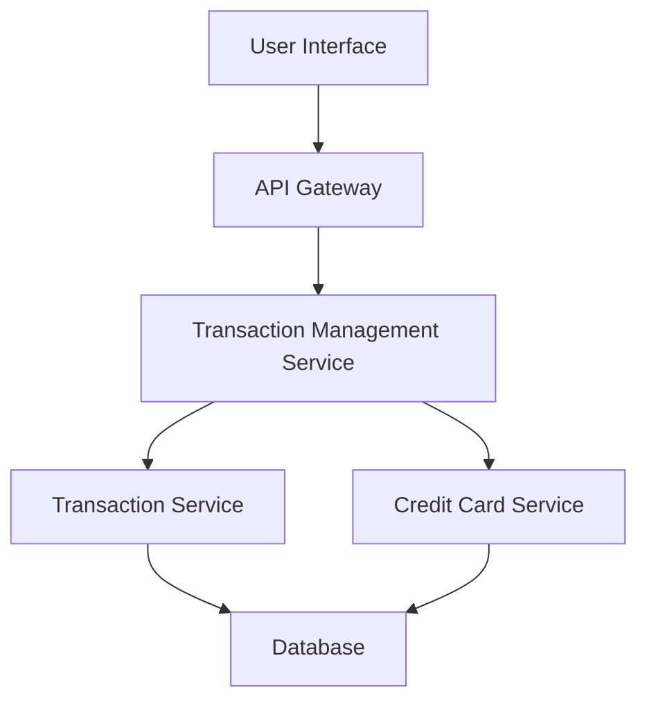

#### 1. High-Level Design

- **Summary:** This epic enables comprehensive transaction viewing and monitoring across all credit cards. Users can access detailed transaction histories, apply filters and search, and track spending at a granular level for complete visibility over credit card usage.

- **Component Flow:**

- **Integration Points:**
  - **Upstream:** Transaction Service (for transaction data retrieval), Credit Card Service (for card-transaction mapping)
  - **Downstream:** User Interface with transaction list and detail views

- **Key Assumptions:**
  - Transactions are stored with timestamps and category metadata for filtering
  - Pagination uses cursor-based or offset-based approach to handle large datasets efficiently

- **NFR Highlights:** Transaction list must support pagination for large datasets, search and filter operations must complete within 1 second, support display of up to 1000 transactions per page load

#### 2. Validation Report

- **Requirements Coverage:** The design addresses all scope items including transaction list view, transaction details display, multi-card aggregation, search and filtering, transaction categorization, and responsive interface. Clear integration with Transaction Service and Credit Card Service is established.

- **Completeness Assessment:** Requirements include specific NFRs for performance (1-second search/filter) and scale (1000 transactions per page). The epic clearly defines read-only operations with transaction editing/deletion explicitly out of scope.

- **Risks and Gaps:**
  - Search indexing strategy not specified to meet 1-second performance requirement
  - Filter criteria (date range, amount range, category, card) not explicitly enumerated
  - Transaction detail fields and data model not defined