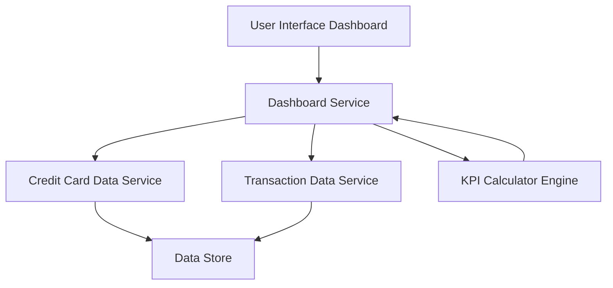

#### 1. High-Level Design

- **Summary**: This epic delivers a consolidated dashboard that displays key performance indicators (KPIs) for users' credit card portfolios. The dashboard aggregates data from multiple credit cards to show monthly spend, total credit limit, available credit, and outstanding amounts, providing users with a comprehensive view of their credit card financial health.

- **Component Flow**:

- **Integration Points**: 
  - **Upstream**: Credit card data source for card details and balances; Transaction data service for spend calculations
  - **Downstream**: User interface layer for dashboard rendering across devices (web, mobile)

- **Key Assumptions**: 
  - Credit card data and transaction data are available via RESTful APIs or similar integration patterns
  - KPI calculations (available credit, outstanding amounts) are computed in real-time or near-real-time based on latest transaction data

- **NFR Highlights**: Dashboard must be responsive across devices; KPI calculations must be accurate and real-time; System must support viewing multiple credit cards simultaneously

- **Data Flow**: User requests dashboard → Dashboard Service fetches credit card details from Credit Card Data Service and transaction data from Transaction Data Service → KPI Calculator Engine aggregates data to compute monthly spend, total credit limit, available credit, and outstanding amounts → Calculated KPIs are returned to Dashboard Service → Dashboard UI renders consolidated view with all KPIs for multiple credit cards

#### 2. Validation Report

- **Requirements Coverage**: The design covers all stated requirements including dashboard KPIs display, monthly spend tracking, total credit limit aggregation, available credit calculation, outstanding amount display, multiple credit card view, and consolidated credit card interface. The architecture supports responsive rendering and real-time KPI calculations as specified in the NFRs. Integration points with credit card data source and transaction data service are identified and incorporated into the component flow.

- **Traceability**: All scope items (Dashboard KPIs display, Monthly spend tracking, Total credit limit aggregation, Available credit calculation, Outstanding amount display, Multiple credit card view, Consolidated credit card interface) are mapped to components in the design (Dashboard Service, KPI Calculator Engine, Credit Card Data Service, Transaction Data Service).

- **NFR Validation**: The design addresses the specified non-functional requirements:
  - Responsive design across devices is supported through the User Interface Dashboard component
  - Real-time and accurate KPI calculations are handled by the dedicated KPI Calculator Engine
  - Multiple credit card support is inherent in the data aggregation logic of the Dashboard Service

- **Dependency Validation**: Both dependencies are addressed:
  - Credit card data source integration is represented by the Credit Card Data Service component
  - Transaction data service integration is represented by the Transaction Data Service component

- **Out of Scope Confirmation**: The design correctly excludes real bank integration, card payments, fund transfers, loans, and payment gateway integration as specified in the epic's out-of-scope section.