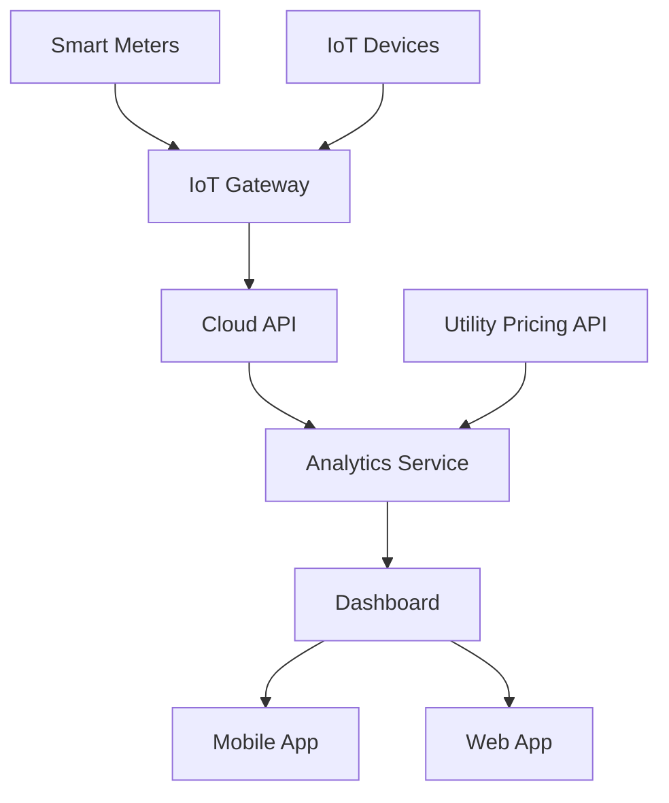

#### 1. High-Level Design

- **Summary**: This epic delivers a comprehensive real-time energy monitoring solution that enables homeowners to track household energy consumption at both aggregate and device levels. The system collects data from smart meters and connected IoT devices, processes it through cloud analytics services, and presents insights via an intuitive dashboard accessible on mobile and web platforms. Users can view consumption patterns across multiple time horizons (daily/weekly/monthly), receive cost estimates based on utility pricing, and get alerted to peak usage or abnormal consumption patterns.

- **Component Flow**:

- **Integration Points**: 
  - **Upstream**: Smart meters (real-time data collection), IoT-enabled devices (Matter, Zigbee, Wi-Fi protocols), Utility APIs (pricing data integration)
  - **Downstream**: Mobile and web dashboard applications, notification services for alerts

- **Key Assumptions**: 
  - Smart meter data is transmitted at intervals of 15 minutes or less for "real-time" monitoring
  - Utility pricing API provides rate information updated at least daily, with support for time-of-use and tiered pricing structures

- **NFR Highlights**: Dashboard must load in under 2 seconds; 99.5% uptime; support for 100+ devices per household; end-to-end encryption; GDPR/CCPA-ready data handling

- **Data Flow**: Smart meters and IoT devices continuously transmit energy consumption data via IoT protocols to an IoT Gateway. The Gateway forwards data to the Cloud API, which stores raw telemetry and passes it to the Analytics Service. The Analytics Service enriches the data with utility pricing information from external APIs, performs aggregations (device-level, time-based), calculates cost estimates, and detects anomalies or peak usage patterns. Processed insights are served to the Dashboard layer, which renders visualizations on Mobile and Web Apps. Alert notifications are triggered when thresholds are exceeded.

#### 2. Validation Report

- **Requirements Coverage**: The design fully addresses the epic's stated scope including real-time monitoring, device-level tracking, multi-timeframe analytics (daily/weekly/monthly), cost estimation, peak usage alerts, and abnormal consumption notifications. All NFRs are incorporated: sub-2-second dashboard load, 99.5% uptime, 100+ device support, end-to-end encryption, and GDPR/CCPA compliance. The architecture supports all specified dependencies (smart meters, utility APIs, IoT protocols, cloud API, analytics service) and respects out-of-scope boundaries (no AI optimization, carbon tracking, voice integration, or EV management).