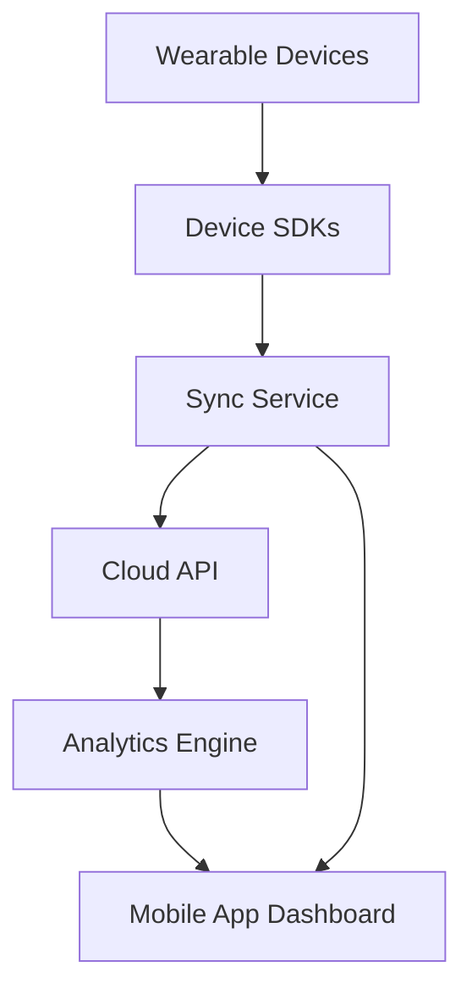

#### 1. High-Level Design

- **Summary**: This epic enables integration with popular wearable devices (Apple Watch, Fitbit, Garmin, Wear OS) to synchronize activity data including steps, heart rate, calories burned, distance, and workouts. It provides a unified dashboard for users to view all their activity metrics from multiple wearable ecosystems in a single platform, with real-time health monitoring capabilities and offline caching support.

- **Component Flow**:

- **Integration Points**: 
  - Upstream: Apple Health, Google Health Connect, Fitbit SDK, Garmin SDK, Wear OS SDK
  - Downstream: Cloud API, Analytics engine for data processing and insights
  - Internal: Mobile application dashboard for data visualization

- **Key Assumptions**: 
  - Users grant necessary permissions for health data access on their devices during pairing
  - Wearable devices maintain active Bluetooth/network connectivity for real-time sync; offline data is cached locally and synced when connectivity resumes

- **NFR Highlights**: Sync latency under 60 seconds, 99.9% uptime, battery-efficient background syncing, secure health data encryption, GDPR and health data regulation compliance

- **Data Flow**: Wearable devices capture health metrics (steps, heart rate, calories, distance, workouts) which are transmitted through respective device SDKs (Apple Health, Google Health Connect, Fitbit, Garmin, Wear OS) to the Sync Service. The Sync Service performs background synchronization with retry mechanisms for offline scenarios, pushing data to the Cloud API. The Cloud API stores encrypted health data and forwards it to the Analytics Engine for processing. Processed data is then rendered on the Mobile App Dashboard, providing users with real-time activity metrics and daily summaries.

#### 2. Validation Report

- **Requirements Coverage**: The design comprehensively covers all stated requirements including wearable device pairing and authentication, real-time data synchronization for all specified metrics (steps, heart rate, calories, distance), workout session tracking, daily activity dashboard, integration with all listed SDKs (Apple Health, Google Health Connect, Fitbit, Garmin, Wear OS), background data synchronization, and offline caching with retry mechanisms. The architecture supports the NFRs for sync latency (under 60 seconds), uptime (99.9%), battery efficiency, security (encryption), and regulatory compliance (GDPR and health data regulations). All dependencies on external SDKs, Cloud API, and Analytics engine are accounted for in the component flow. The scope explicitly excludes AI nutrition coach, workout recommendations, recovery optimization, social challenges, and trainer marketplace, which are not addressed in this design.