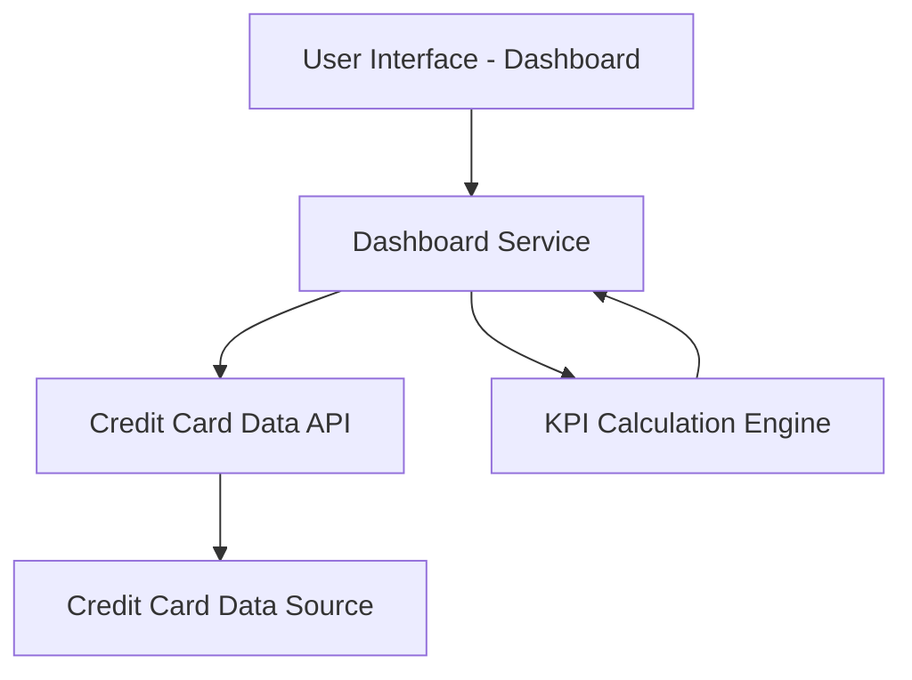

#### 1. High-Level Design

**Summary:** This epic delivers a consolidated dashboard interface that displays key performance indicators (KPIs) for users' credit card portfolios. The dashboard aggregates and presents monthly spend, total credit limit, available credit, and outstanding amounts across multiple credit cards, enabling users to monitor their overall credit card financial health from a single view.

**Component Flow:**

**Integration Points:**
- Credit card data sources for retrieving card details, balances, and credit limits
- Dashboard module serves as integration hub for other modules (analytics, transactions)

**Key Assumptions:**
- Credit card data is available via API with near real-time refresh capability
- KPI calculations (available credit, utilization) follow standard formulas: Available Credit = Total Limit - Outstanding Amount

**NFR Highlights:** Responsive layouts across devices; Dashboard must load within acceptable performance thresholds for real-time financial data display

#### 2. Validation Report

**Requirements Coverage:** The design covers all stated scope elements including KPI display, monthly spend tracking, credit limit aggregation, available credit calculation, outstanding amount display, and multi-card portfolio view. The component flow supports responsive UI and integration with credit card data sources as specified in dependencies.

**Traceability:** All scope items (Dashboard KPIs display, Monthly Spend tracking, Total Credit Limit aggregation, Available Credit calculation, Outstanding Amount display, Multiple Credit Cards view, Consolidated card portfolio interface) are addressed through the Dashboard Service and KPI Calculation Engine components.

**Gaps/Risks:** 
- Epic does not specify data refresh frequency or caching strategy for real-time data
- No details on error handling when credit card data sources are unavailable
- User authentication and authorization mechanisms not specified

**Compliance Notes:** Out-of-scope items clearly exclude real bank integration, payments, fund transfers, loans, and payment gateway integration, reducing regulatory compliance burden for this phase.