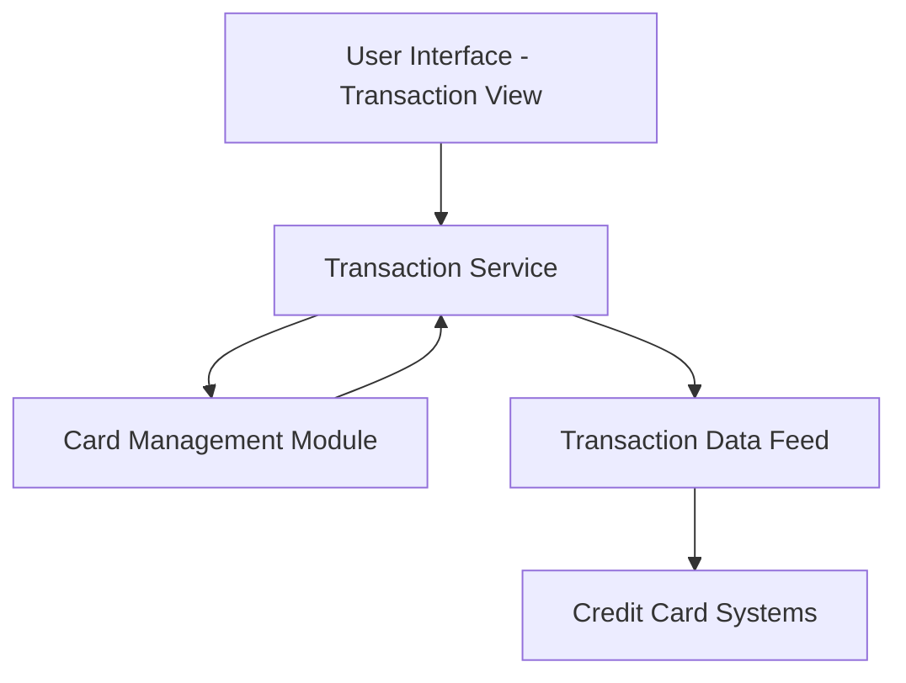

#### 1. High-Level Design

**Summary:** This epic enables users to view and monitor credit card transactions across all their cards. Users can access detailed transaction history with card-wise filtering capabilities, providing comprehensive visibility into spending activities and enabling verification of charges across their credit card portfolio.

**Component Flow:**

**Integration Points:**
- Transaction data feeds from credit card systems for retrieving transaction records
- Card management module for card-specific transaction filtering
- Dashboard module (implicit) for navigation and context

**Key Assumptions:**
- Transaction data is provided in a standardized format with consistent fields (date, amount, merchant, category)
- Transaction history is available for a reasonable period (assume 12-24 months based on typical financial application standards)

**NFR Highlights:** System must handle transaction data efficiently; Transaction views must be responsive and accessible across different devices

#### 2. Validation Report

**Requirements Coverage:** The design addresses all scope elements including transaction listing, viewing across multiple cards, transaction history access, and card-wise filtering. The component flow supports efficient data handling and responsive views as specified in NFRs.

**Traceability:** All scope items (Transaction listing, Transaction viewing across multiple cards, Transaction history access, Card-wise transaction filtering) are mapped to Transaction Service and Card Management Module integration.

**Gaps/Risks:**
- No specification on transaction search, sorting, or advanced filtering capabilities beyond card-wise filtering
- Transaction data volume and pagination strategy not defined
- No mention of transaction detail level (e.g., merchant details, transaction IDs, authorization codes)

**Compliance Notes:** Out-of-scope items exclude real bank integration and payment processing, limiting PCI-DSS and financial regulatory requirements to read-only transaction display.