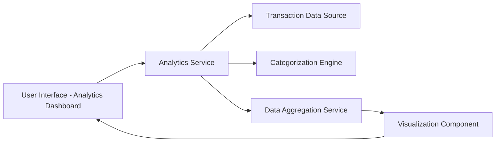

#### 1. High-Level Design

**Summary:** This epic provides interactive visualizations and analytical insights into user spending patterns. It delivers monthly spend trend analysis, card-wise spend breakdowns, and category-wise spending analytics across nine predefined categories (Food & Dining, Fuel, Shopping, Travel, Entertainment, Utilities, Healthcare, Education, Miscellaneous), enabling data-driven financial decision-making.

**Component Flow:**

**Integration Points:**
- Transaction data source for spending calculations and raw transaction data
- Dashboard module for consolidated analytics display and navigation
- Categorization engine or service for transaction classification into predefined categories

**Key Assumptions:**
- Transactions are either pre-categorized by the categorization engine or merchant codes map to the nine predefined categories
- Monthly trends are calculated based on transaction date aggregation with month-over-month comparison capability

**NFR Highlights:** Analytics visualizations must be interactive and responsive; System must support efficient data aggregation for trend analysis and category breakdowns

#### 2. Validation Report

**Requirements Coverage:** The design covers all scope elements including monthly spend trends visualization, card-wise spend analysis, category-wise spending analytics across all nine specified categories, interactive visualizations, and spending pattern identification. The component flow supports interactive, responsive visualizations and efficient data aggregation as required by NFRs.

**Traceability:** All scope items (Monthly Spend Trends visualization, Card-wise Spend Analysis, Category-wise Spending analytics, Interactive visualizations, Spending pattern identification) are addressed through Analytics Service, Data Aggregation Service, and Visualization Component.

**Gaps/Risks:**
- Categorization logic and accuracy not specified; unclear if manual re-categorization is supported
- Time range for trend analysis not defined (e.g., last 6 months, 12 months, custom range)
- No specification on export capabilities for analytics data or visualizations
- Interactivity level not detailed (drill-down, filtering, date range selection)

**Compliance Notes:** Out-of-scope items exclude real bank integration, payments, and gateway integration. Analytics remain read-only and non-transactional, reducing compliance complexity.