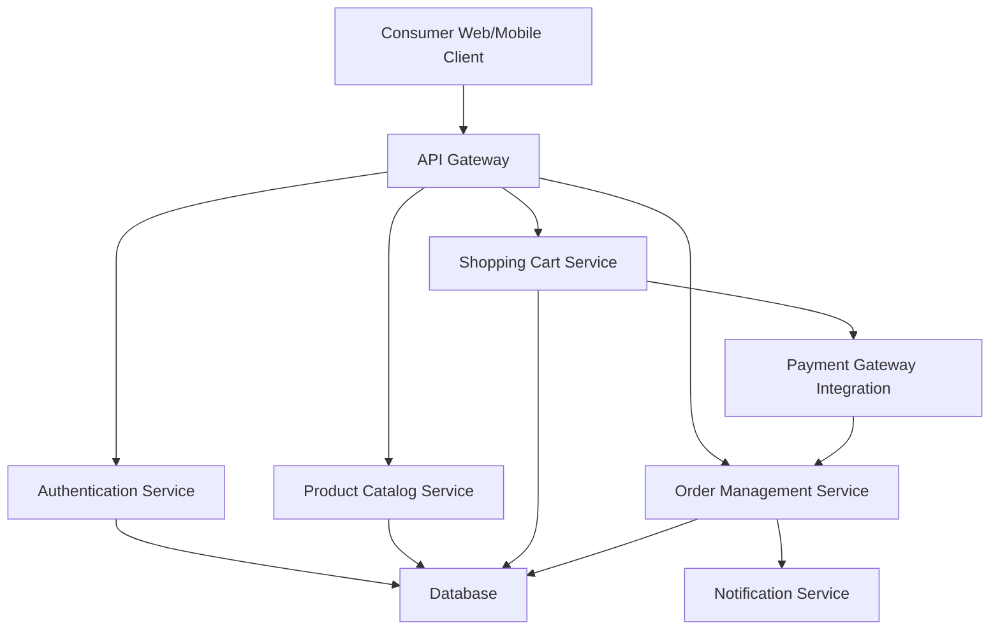

#### 1. High-Level Design

- **Summary**: This epic delivers a complete end-to-end consumer shopping experience for an online shopping platform, covering product discovery through keyword and category-based search, shopping cart management, secure checkout with payment integration, order tracking, and post-purchase features including reviews, ratings, and wishlists. The solution must be accessible across web and mobile web platforms with WCAG 2.1 AA compliance.

- **Component Flow**:

- **Integration Points**: 
  - **Upstream**: Third-party payment gateway APIs (e.g., Stripe, PayPal) for payment processing; Email/SMS notification providers for order confirmations and status updates; Third-party logistics APIs for shipping and tracking updates
  - **Downstream**: Cloud hosting and CDN services for platform delivery and static content; Database systems for user, product, cart, and order data persistence

- **Key Assumptions**: 
  - Product catalog data is pre-populated and maintained by sellers through a separate seller management system
  - Payment gateway supports multiple payment methods (credit/debit cards, digital wallets) and handles PCI DSS compliance on their end

- **NFR Highlights**: Page load times ≤2 seconds for 95% of requests; Checkout completion ≤5 seconds; Support 100,000 concurrent users with horizontal scaling; 99.9% uptime SLA; PCI DSS compliance; All data encrypted; 30-minute recovery time for critical failures

- **Data Flow**: 
  1. **Product Discovery**: Consumer searches/browses → API Gateway → Product Catalog Service queries database with filters/sorting → Returns product listings to client
  2. **Cart Management**: Consumer adds items → Shopping Cart Service stores cart state in database → Real-time cart updates reflected in UI
  3. **Checkout**: Consumer initiates checkout → Payment Gateway Integration processes payment securely → On success, Order Management Service creates order record in database
  4. **Order Tracking**: Order Management Service updates order status → Notification Service sends real-time updates via email/SMS → Consumer views order status through client
  5. **Post-Purchase**: Consumer submits reviews/ratings → Stored in database and associated with products → Wishlist items stored per user in database

#### 2. Validation Report

- **Requirements Coverage**: The high-level design fully covers the epic's stated scope including user registration/authentication, product catalog with search/filter/sort, shopping cart, secure checkout with payment integration, order tracking with real-time notifications, order cancellation/refunds, reviews/ratings, wishlist functionality, and accessibility compliance. All NFRs are addressed through architectural choices (horizontal scaling, CDN, encrypted data, payment gateway integration, failover mechanisms). The component architecture supports all specified user journeys from product discovery through post-purchase engagement.

- **Traceability**: 
  - User registration/authentication → Authentication Service
  - Product catalog with search/filter/sort → Product Catalog Service
  - Shopping cart and checkout → Shopping Cart Service + Payment Gateway Integration
  - Order tracking and status updates → Order Management Service + Notification Service
  - Reviews, ratings, wishlist → Product Catalog Service (reviews/ratings) + Database (wishlist storage)
  - Accessibility WCAG 2.1 AA → Implemented at Consumer Web/Mobile Client layer

- **Gaps/Risks**: 
  - **Gap**: Epic does not specify the exact payment methods to be supported (credit/debit cards, digital wallets, buy-now-pay-later, etc.)
  - **Gap**: Refund processing workflow details are not specified (automatic vs. manual approval, refund timelines, partial refunds)
  - **Risk**: Dependency on third-party payment gateway and logistics APIs introduces external failure points; mitigation requires fallback mechanisms and circuit breakers
  - **Risk**: Achieving 2-second page load for 100,000 concurrent users requires aggressive caching strategy and CDN optimization not detailed in epic
  - **Gap**: Order cancellation rules not specified (time window for cancellation, cancellation after shipment, restocking fees)

- **Compliance Check**: 
  - ✅ PCI DSS compliance addressed through third-party payment gateway integration
  - ✅ Data encryption requirement covered for all user data and transactions
  - ✅ WCAG 2.1 AA accessibility compliance specified for web and mobile web platforms
  - ✅ 99.9% uptime SLA supported by automated failover and backup mechanisms
  - ✅ 30-minute recovery time objective for critical failures

- **Recommendations**: 
  1. Define specific payment methods to be supported in initial release vs. future phases
  2. Document detailed refund approval workflow and timelines
  3. Implement circuit breaker pattern for all third-party API integrations (payment gateway, logistics, notifications)
  4. Establish CDN caching strategy and performance testing plan to validate 2-second page load requirement under peak load
  5. Define order cancellation business rules including time windows and conditions
  6. Consider implementing a search service (e.g., Elasticsearch) for advanced product search and filtering capabilities at scale