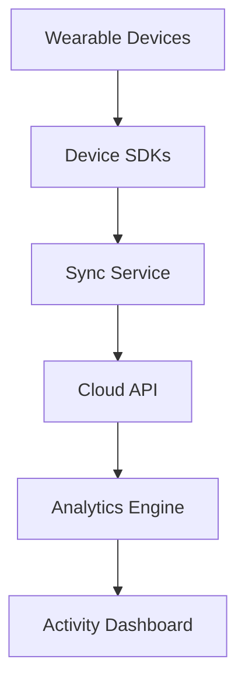

#### 1. High-Level Design

**Summary:** This epic delivers seamless integration with major wearable devices (Apple Watch, Fitbit, Garmin, Wear OS) to automatically sync health and fitness data including steps, heart rate, calories burned, distance, and workouts. A unified daily activity dashboard consolidates all wearable data, eliminating manual entry and providing users with a comprehensive view of their fitness progress in real-time.

**Component Flow:**

**Integration Points:**
- **Upstream Systems:** Apple Health, Google Health Connect, Fitbit SDK, Garmin SDK, wearable device SDKs
- **Downstream Systems:** Cloud API for data persistence, analytics engine for data processing and aggregation
- **Background sync service** for continuous data synchronization

**Key Assumptions:**
- Wearable devices push data to their respective health platforms (Apple Health, Google Health Connect, etc.) which are then polled or subscribed to by the sync service at regular intervals (assumed every 30-60 seconds).
- Users grant necessary permissions for health data access during onboarding; the system handles token refresh and re-authentication automatically.

**NFR Highlights:** Sync latency under 60 seconds; 99.9% uptime; battery-efficient background syncing; secure health data encryption; GDPR and health data regulation compliance.

**Data Flow:** Wearable devices capture real-time health metrics (steps, heart rate, calories, distance, workouts) and transmit to their native health platforms (Apple Health, Google Health Connect, etc.). The sync service polls or receives webhooks from these platforms via their respective SDKs, transforms the data into a unified format, and sends it to the cloud API. The cloud API persists the data securely with encryption and forwards it to the analytics engine for aggregation and processing. The analytics engine calculates daily summaries, trends, and consolidated metrics, which are then displayed on the activity dashboard for user consumption.

#### 2. Validation Report

**Requirements Coverage:** The design fully covers the epic's stated scope including integration with all specified wearable platforms (Apple Watch, Fitbit, Garmin, Wear OS), automatic synchronization of all required metrics (steps, heart rate, calories burned, distance, workouts), background data synchronization, and the daily activity dashboard. All NFRs are addressed through appropriate architectural choices: sync latency is managed by the sync service architecture, uptime requirements are supported by cloud infrastructure, battery efficiency is achieved through optimized background sync intervals, security is ensured via encryption at rest and in transit, and compliance is built into data handling policies. All stated dependencies (Apple Health, Google Health Connect, Fitbit SDK, Garmin SDK, cloud API, analytics engine) are incorporated into the component flow. Out-of-scope items (AI nutrition coach, workout recommendations, recovery/sleep optimization, social challenges, trainer marketplace) are correctly excluded from this design.