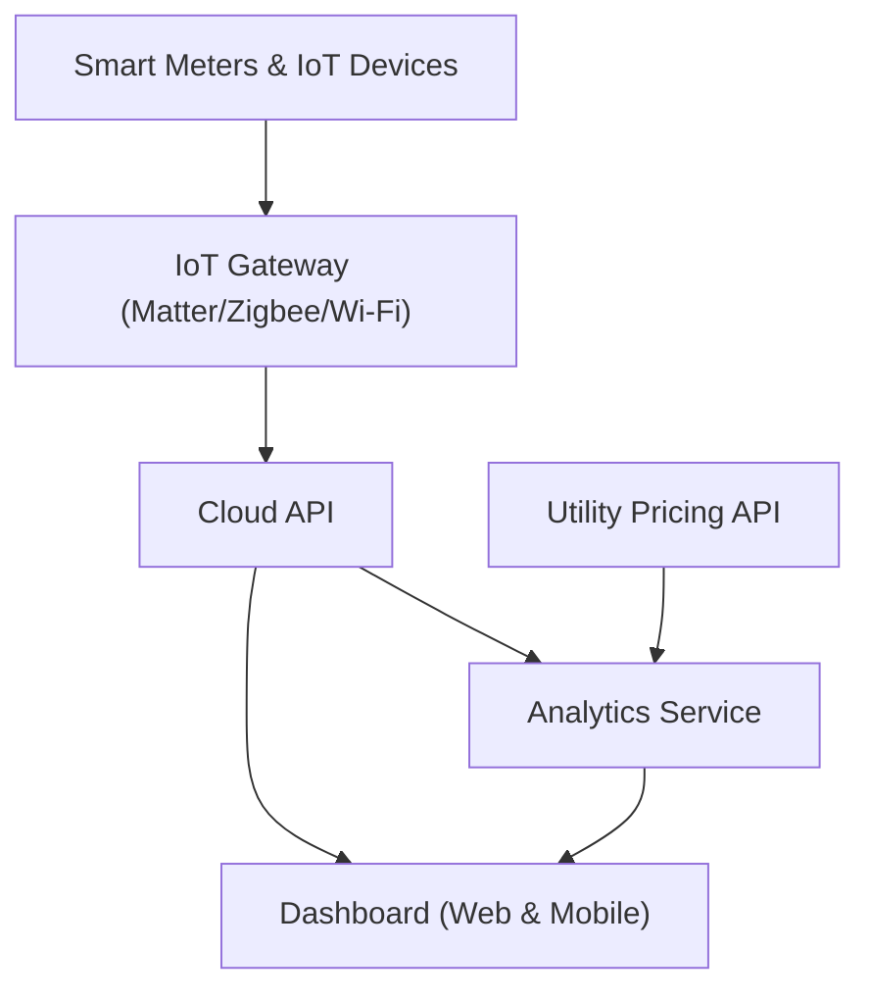

#### 1. High-Level Design

- **Summary**: This epic delivers a comprehensive real-time energy monitoring solution that enables homeowners to track household energy consumption at both aggregate and device levels. The system provides an interactive dashboard accessible via mobile (iOS/Android) and web platforms, displaying current usage, historical trends (daily/weekly/monthly), cost estimates based on utility pricing, and intelligent alerts for peak usage and abnormal consumption patterns. The solution integrates with smart meters and IoT-enabled devices to collect granular energy data and presents actionable insights to help users reduce electricity costs by 10-25%.

- **Component Flow**:

- **Integration Points**: 
  - **Upstream**: Smart meters (real-time consumption data), IoT-enabled appliances (device-level data via Matter, Zigbee, Wi-Fi protocols), Utility APIs (real-time and time-of-use pricing data)
  - **Downstream**: Frontend mobile platforms (iOS/Android native apps), Web dashboard (browser-based interface), Analytics service (consumption pattern analysis and alerting engine)

- **Key Assumptions**: 
  - Smart meters provide consumption data at minimum 15-minute intervals via standard protocols (e.g., MQTT, REST API)
  - Utility pricing APIs are available and provide real-time or near-real-time rate information; fallback to cached pricing if API unavailable

- **NFR Highlights**: Dashboard load time <2 seconds, 99.5% uptime, end-to-end encryption, GDPR/CCPA-ready data handling, support for 100+ connected devices per household

- **Data Flow**: Smart meters and IoT devices continuously stream energy consumption data through the IoT Gateway using Matter, Zigbee, or Wi-Fi protocols. The Cloud API ingests this telemetry data and stores it in time-series format. The Analytics Service processes raw consumption data, correlates it with utility pricing information fetched from external Utility APIs, calculates cost estimates, detects anomalies (peak usage, abnormal patterns), and generates alerts. The Dashboard (Web & Mobile) queries both the Cloud API (for real-time and historical data) and Analytics Service (for insights, trends, and alerts) to render interactive visualizations including current usage, daily/weekly/monthly charts, cost breakdowns, and device-level consumption metrics. User interactions and configuration changes flow back through the Cloud API to update preferences and alert thresholds.

#### 2. Validation Report

- **Requirements Coverage**: The design fully addresses the epic's stated scope including real-time monitoring, device-level tracking, interactive dashboard with temporal views, cost estimation via utility pricing integration, and alerting for peak/abnormal usage. All specified NFRs (2-second load time, 99.5% uptime, encryption, GDPR/CCPA compliance, 100+ device support) are incorporated into the architecture through appropriate service layers and security controls. The component flow demonstrates clear data pathways from smart meters through analytics to user-facing dashboards across web and mobile platforms. Integration dependencies on smart meters, utility APIs, IoT protocols, and cloud infrastructure are explicitly mapped. The design respects the out-of-scope boundaries by excluding AI optimization, solar/battery management, EV charging, voice assistants, carbon tracking, and premium features, maintaining focus on core monitoring and visualization capabilities.