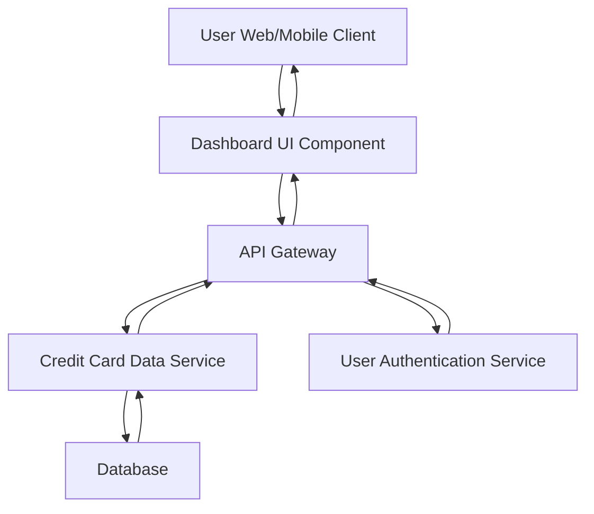

#### 1. High-Level Design

- **Summary**: This epic delivers a consolidated dashboard that displays key performance indicators (KPIs) for users' credit card portfolios. Users can view monthly spend, total credit limit, available credit, and outstanding amounts across multiple credit cards from a single unified interface, enabling comprehensive financial oversight and informed decision-making.

- **Component Flow**:

- **Integration Points**: 
  - **Upstream**: User Authentication Service (for secure access to user-specific card information)
  - **Downstream**: Credit Card Data Service (for retrieving card details, balances, and limits)

- **Key Assumptions**: 
  - Credit card data is updated in near real-time or with acceptable latency for balance and limit information
  - KPI calculations (available credit, outstanding amount) are performed by the Credit Card Data Service or API layer

- **NFR Highlights**: Dashboard must be responsive across desktop, tablet, and mobile devices; Page load time must be optimized for quick KPI display; System must handle real-time data refresh for accurate balance information

- **Data Flow**: User authenticates via the User Authentication Service. Upon successful authentication, the Dashboard UI Component requests consolidated credit card data through the API Gateway. The API Gateway routes the request to the Credit Card Data Service, which queries the Database for card details, balances, limits, and transaction summaries. The service aggregates data across multiple cards, calculates KPIs (monthly spend, total credit limit, available credit, outstanding amount), and returns the consolidated information through the API Gateway to the Dashboard UI Component. The UI renders the KPIs in a responsive format optimized for the user's device.

#### 2. Validation Report

- **Requirements Coverage**: The design fully covers the epic's stated scope including dashboard KPIs display, monthly spend tracking, total credit limit aggregation, available credit calculation, outstanding amount display, multiple credit card view, and consolidated credit card interface. All dependencies (credit card data service, user authentication service) are incorporated into the architecture. The design explicitly addresses the NFRs for responsive design across devices, optimized page load time, and real-time data refresh capabilities. Out-of-scope items (real bank integration, card payments, fund transfers, loans, payment gateway integration) are appropriately excluded from the design.