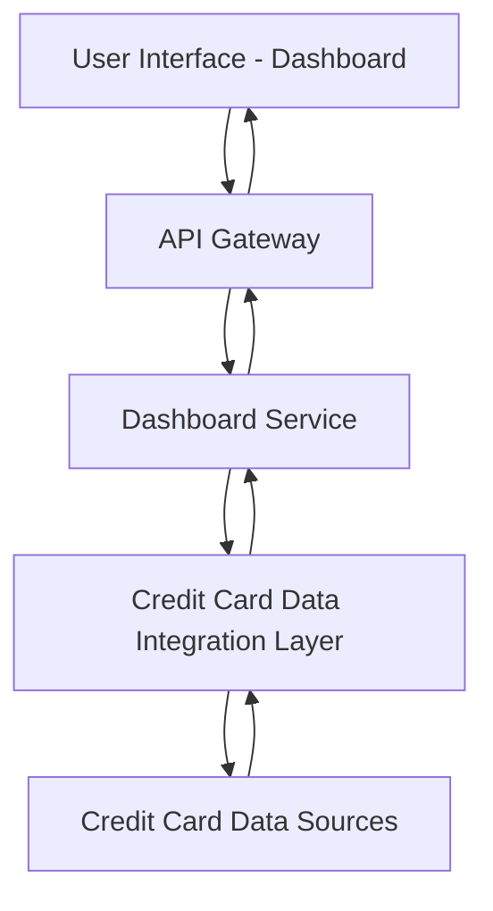

#### 1. High-Level Design

- **Summary**: This epic delivers a consolidated dashboard that displays key performance indicators (KPIs) for users' credit card portfolios. The core requirement is to provide a single-interface view of multiple credit cards showing monthly spend, total credit limit, available credit, and outstanding amounts. The scope includes aggregating data from multiple credit cards and presenting real-time financial health metrics to enable better credit utilization management.

- **Component Flow**: 

- **Integration Points**: 
  - **Upstream**: Credit card data sources (external systems providing card details, balances, credit limits, and outstanding amounts)
  - **Downstream**: User Interface/Dashboard (web and mobile clients consuming the aggregated KPI data)

- **Key Assumptions**: 
  - Credit card data sources provide standardized API responses with card balance, limit, and transaction data in JSON format
  - Data refresh frequency is near real-time or within acceptable latency thresholds (e.g., data updated every 5-15 minutes)

- **NFR Highlights**: System must provide responsive layouts across devices; Dashboard must load within acceptable performance thresholds for real-time financial data display

- **Data Flow**: User requests dashboard view → API Gateway authenticates and routes request → Dashboard Service retrieves user's credit card list → Integration Layer fetches current balances, limits, and outstanding amounts from Credit Card Data Sources → Dashboard Service aggregates data (calculates total credit limit, available credit across all cards, monthly spend totals) → Processed KPIs returned through API Gateway → User Interface renders consolidated dashboard with multiple card overview and financial health metrics

#### 2. Validation Report

- **Requirements Coverage**: The design fully covers the epic's stated scope including dashboard KPIs display, monthly spend tracking, total credit limit aggregation, available credit calculation, outstanding amount tracking, multiple credit card view, and consolidated credit card interface. The component architecture supports responsive layouts and real-time data display as specified in the NFRs. The integration layer addresses the dependency on credit card data sources for card details, balances, and limits. The design explicitly excludes out-of-scope items (real bank integration, card payments, fund transfers, loans, payment gateway integration) by focusing solely on read-only dashboard and KPI display functionality.