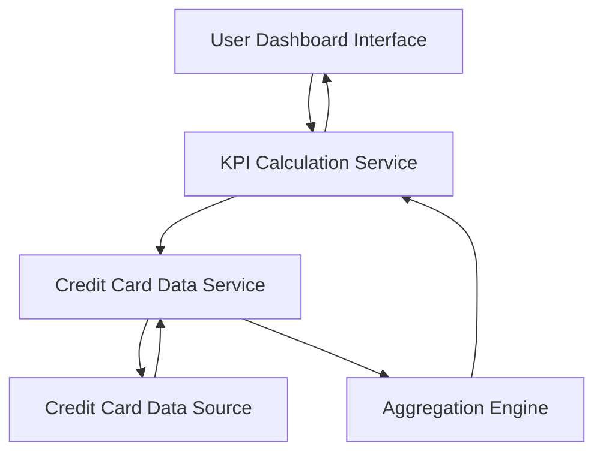

#### 1. High-Level Design

- **Summary**: This epic provides a consolidated dashboard displaying key performance indicators (KPIs) for the user's credit card portfolio, including monthly spend, total credit limit, available credit, and outstanding amounts. The dashboard aggregates data from multiple credit cards into a single comprehensive view.

- **Component Flow**:

- **Integration Points**: 
  - Upstream: Credit card data sources for card details, balances, and credit limits
  - Downstream: Responsive UI framework for cross-device display

- **Key Assumptions**: 
  - Credit card data is refreshed periodically to reflect current balances and limits
  - KPI calculations (monthly spend, available credit, outstanding amounts) are computed on-demand or cached with acceptable latency

- **NFR Highlights**: System must support responsive layouts across devices and dashboard must load within acceptable performance thresholds for real-time financial data display

- **Data Flow**: User accesses dashboard → KPI Calculation Service requests data from Credit Card Data Service → Credit Card Data Service retrieves card details, balances, and limits from Credit Card Data Source → Aggregation Engine consolidates data across multiple cards → KPI Calculation Service computes monthly spend, total credit limit, available credit, and outstanding amounts → Calculated KPIs are rendered on the User Dashboard Interface with responsive layout

#### 2. Validation Report

- **Requirements Coverage**: The design fully covers all scope items including dashboard KPIs display, monthly spend tracking, total credit limit calculation, available credit display, outstanding amount tracking, multiple credit cards view, and consolidated card overview interface. The architecture addresses NFRs for responsive layouts and performance thresholds through dedicated calculation and aggregation services. Dependencies on credit card data sources are satisfied through the Credit Card Data Service component.