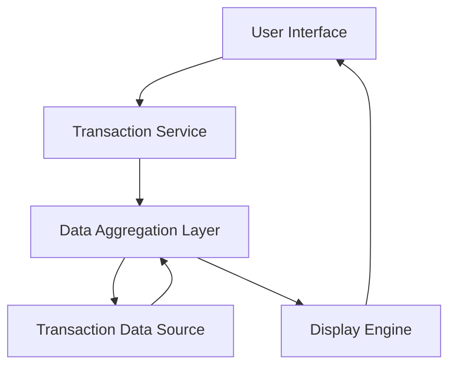

#### 1. High-Level Design

- **Summary**: This epic delivers transaction viewing and monitoring capabilities across multiple credit cards. Users can access transaction history, view transaction details, and track spending activities through a consolidated interface that aggregates transactions from all their credit cards.

- **Component Flow**:

- **Integration Points**: 
  - Upstream: Transaction data sources (credit card transaction records)
  - Downstream: User interface layer for responsive display across devices

- **Key Assumptions**: 
  - Transaction data is available in a standardized format from the data source
  - Transaction refresh occurs at regular intervals (real-time or near-real-time not specified)

- **NFR Highlights**: System must handle transaction data retrieval efficiently and support responsive layouts across devices

- **Data Flow**: User requests transaction data through the UI → Transaction Service queries the Data Aggregation Layer → Data Aggregation Layer retrieves records from Transaction Data Source → Aggregated data is processed and formatted by Display Engine → Rendered transaction history and details are presented to the user across all their credit cards

#### 2. Validation Report

- **Requirements Coverage**: The design covers all stated scope items including transaction viewing, transaction history access, multi-card transaction consolidation, and transaction details display. The architecture supports efficient data retrieval and responsive layouts as specified in NFRs. Dependencies on transaction data sources are addressed through the Data Aggregation Layer component.