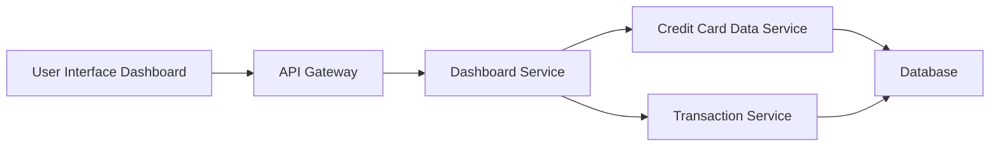

#### 1. High-Level Design

**Summary:** This epic delivers a consolidated dashboard interface that displays key performance indicators (KPIs) for all user credit cards in a single view. The dashboard aggregates and presents critical financial metrics including monthly spend, total credit limit, available credit, and outstanding amounts to enable informed financial decision-making and credit utilization management.

**Component Flow:**

**Integration Points:**
- **Upstream:** Credit Card Data Service (retrieves card details, balances, credit limits)
- **Upstream:** Transaction Service (calculates monthly spend aggregations)
- **Downstream:** User Interface (web/mobile clients consuming dashboard data)

**Key Assumptions:**
- Data aggregation occurs server-side with caching to meet 2-second load time requirement
- Real-time refresh uses polling or push notifications at configurable intervals (assumed every 30-60 seconds)

**NFR Highlights:** Dashboard must be responsive across all device types; Page load time must be under 2 seconds; System must support real-time data refresh for KPIs

#### 2. Validation Report

**Requirements Coverage:** The design addresses all stated scope items including KPI display, monthly spend tracking, credit limit aggregation, available credit calculation, outstanding amount display, and multi-card consolidated view. The architecture supports responsive design and real-time data refresh through integration with backend services.

**Traceability:** All scope elements (Dashboard KPIs display, Monthly spend tracking, Total credit limit aggregation, Available credit calculation, Outstanding amount display, Multiple credit cards view, Consolidated card interface) are covered by the Dashboard Service component which orchestrates data retrieval from Credit Card Data Service and Transaction Service.

**Completeness Check:** All functional requirements are addressed. NFRs for responsiveness, 2-second load time, and real-time refresh are supported through the proposed architecture with caching and optimized data retrieval patterns.

**Gaps/Risks Identified:**
- Performance risk: Aggregating data from multiple cards in real-time may challenge the 2-second load time requirement for users with many cards
- Caching strategy not specified: Need to define cache invalidation policy for real-time data refresh
- Error handling: No specification for handling partial data availability when one service is degraded