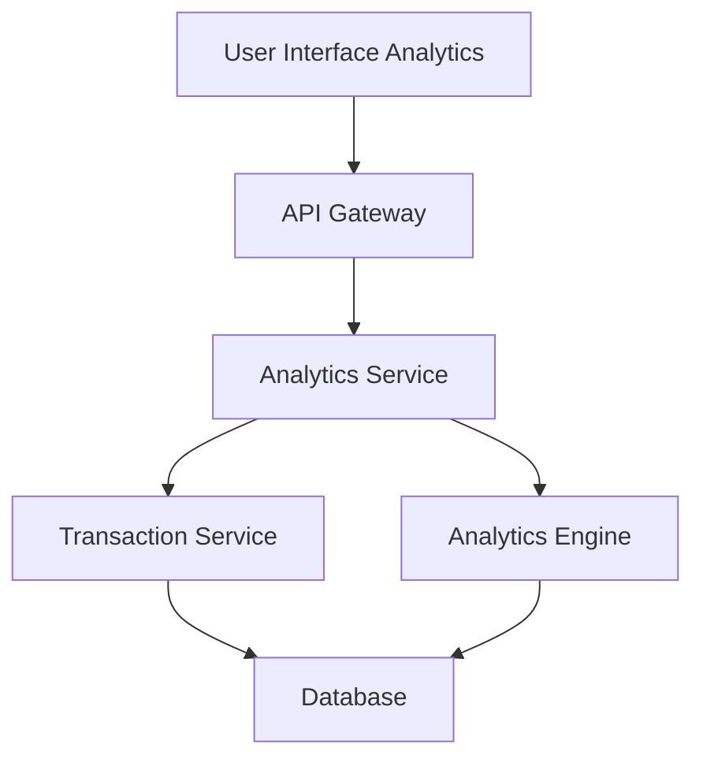

#### 1. High-Level Design

**Summary:** This epic provides interactive visualizations and analytics capabilities enabling users to understand spending patterns across 9 predefined categories (Food & Dining, Fuel, Shopping, Travel, Entertainment, Utilities, Healthcare, Education, Miscellaneous). The feature delivers category-wise breakdowns, monthly trends, and card-wise spend analysis to support data-driven budgeting decisions.

**Component Flow:**

**Integration Points:**
- **Upstream:** Transaction Service (retrieves raw transaction data for analysis)
- **Upstream:** Analytics Engine (processes and categorizes spending data into 9 predefined categories)
- **Downstream:** User Interface (renders interactive charts and visualizations)

**Key Assumptions:**
- Transaction categorization is automated by Analytics Engine using predefined rules or ML models
- Historical data is pre-aggregated and stored to support sub-1-second visualization rendering for up to 10,000 transactions

**NFR Highlights:** Visualizations must render within 1 second; System must handle up to 10,000 transactions per user for analytics; Charts must be responsive and interactive

#### 2. Validation Report

**Requirements Coverage:** The design covers all scope elements including category-wise spending visualization, interactive charts, monthly spend trends, card-wise analysis, and spending pattern identification across 9 categories. The architecture supports the NFRs through pre-aggregation and optimized data processing.

**Traceability:** All scope items (Category-wise spending visualization, Interactive charts and graphs, Monthly spend trends analysis, Card-wise spend analysis, Spending pattern identification) are implemented through the Analytics Service coordinating with Transaction Service and Analytics Engine.

**Completeness Check:** All functional requirements are addressed. NFRs for 1-second rendering, 10,000 transaction handling, and responsive interactive charts are supported through the Analytics Engine's processing capabilities and optimized data structures.

**Gaps/Risks Identified:**
- Scalability concern: 10,000 transactions per user may require efficient indexing and query optimization
- Category accuracy: No specification for handling miscategorized transactions or user feedback mechanism
- Data freshness: No specification for how frequently analytics data is refreshed from transaction data