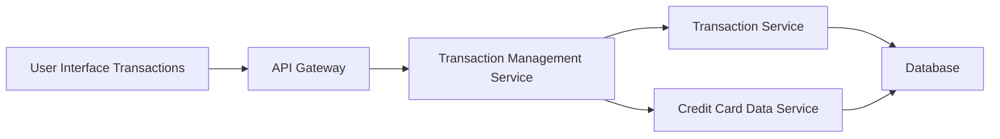

#### 1. High-Level Design

**Summary:** This epic delivers comprehensive transaction management capabilities allowing users to view, track, and manage transactions across all credit cards. The feature provides detailed transaction histories, card-specific filtering, and real-time monitoring to ensure complete transparency and traceability of all card operations.

**Component Flow:**

**Integration Points:**
- **Upstream:** Transaction Service (fetches transaction records with filtering and pagination)
- **Upstream:** Credit Card Data Service (links transactions to specific cards and validates card ownership)
- **Downstream:** User Interface (displays transaction lists and details)

**Key Assumptions:**
- Pagination is implemented with configurable page sizes (assumed 20-50 transactions per page) to handle large volumes
- Transaction data synchronization occurs within 5 minutes from external sources to maintain accuracy

**NFR Highlights:** Transaction list must load within 1.5 seconds; System must support pagination for large transaction volumes; Transaction data must be accurate and up-to-date within 5 minutes of occurrence

#### 2. Validation Report

**Requirements Coverage:** The design addresses all stated scope including transaction listing, card-wise filtering, transaction history tracking, transaction details view, and multi-card transaction management. The architecture supports pagination and real-time monitoring through efficient data retrieval patterns.

**Traceability:** All scope elements (Transaction listing and display, Card-wise transaction filtering, Transaction history tracking, Transaction details view, Multi-card transaction management) are covered by the Transaction Management Service orchestrating data from Transaction Service and Credit Card Data Service.

**Completeness Check:** All functional requirements are addressed. NFRs for 1.5-second load time, pagination support, and 5-minute data accuracy are supported through the proposed architecture with optimized queries and data synchronization mechanisms.

**Gaps/Risks Identified:**
- Data consistency: 5-minute synchronization window may cause temporary discrepancies between actual and displayed transactions
- Search/filter performance: No specification for advanced search capabilities or performance requirements for complex filters
- Audit trail: No specification for tracking user actions on transaction management operations