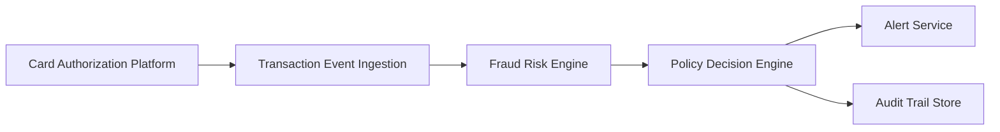

#### 1. High-Level Design

- **Summary**: This epic implements a real-time fraud detection system that ingests credit card transaction events from the authorization platform, evaluates each transaction using a fraud-risk engine to produce risk scores based on multiple signals (unusual amounts, merchant behavior, geographic inconsistencies, velocity patterns, failed authorizations, compromised card indicators), and determines whether to trigger fraud alerts based on configurable risk thresholds. The system maps risk decisions (low/medium/high/confirmed fraud) to appropriate actions through a policy engine while maintaining idempotency and comprehensive audit trails.

- **Component Flow**:

- **Integration Points**: 
  - **Upstream**: Card authorization/transaction platform (source of transaction events)
  - **Downstream**: Fraud-risk engine/model (risk scoring), Policy/decision engine (risk-to-action mapping), Alert service (fraud alert creation), Analytics and audit infrastructure (event capture and monitoring)

- **Key Assumptions**: 
  - Transaction events are delivered via event streaming (e.g., Kafka) with guaranteed delivery semantics
  - Fraud-risk engine provides synchronous or near-synchronous scoring API with sub-second response times

- **NFR Highlights**: Risk evaluation and alert triggering must meet agreed transaction-time SLA; Support transaction spikes without unacceptable alert delays; High availability for security-critical services with defined disaster recovery; Idempotency, retries, event versioning, and durable audit records required

- **Data Flow**: Transaction events flow from the card authorization platform to the ingestion layer, which validates and normalizes the data. The fraud risk engine receives transaction details and evaluates risk signals (amount patterns, merchant reputation, geographic anomalies, velocity metrics, authorization failures, compromised card indicators) to generate a risk score and classification (low/medium/high/confirmed fraud). The policy decision engine applies configurable thresholds to map risk levels to actions (no alert, send alert, escalate). If an alert is required, the decision is sent to the alert service for customer notification. All risk decisions, model versions, and policy applications are logged to the audit trail store for compliance, monitoring, and model performance analysis.

#### 2. Validation Report

- **Requirements Coverage**: The design fully addresses the epic's core requirements including real-time transaction ingestion, risk scoring with multiple signal evaluation, configurable threshold management, policy-based decision mapping, idempotency handling, and comprehensive audit trails. All stated NFRs (transaction-time SLA, spike handling, high availability, idempotency, monitoring) are incorporated into the architecture. Integration points with card authorization platform, fraud-risk engine, policy engine, and analytics infrastructure are clearly identified and aligned with stated dependencies.