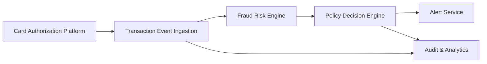

#### 1. High-Level Design

- **Summary**: This epic delivers the foundational fraud detection capability that ingests credit card transaction events in real-time, evaluates them using a fraud-risk scoring engine with multiple signals (transaction patterns, merchant behavior, geographic inconsistencies, velocity, device risk), classifies transactions into risk bands (low, medium, high), and maps them to appropriate actions (approve, alert, step-up verification, hold, decline) based on configurable thresholds. The system ensures idempotency, implements fail-safe policies, and maintains comprehensive audit trails for all risk decisions.

- **Component Flow**:

- **Integration Points**: 
  - **Upstream**: Card authorization/transaction platform (source of transaction events)
  - **Downstream**: Fraud-risk engine/model (risk scoring service), Policy/decision engine (risk-to-action mapping), Alert service (for triggering customer notifications), Analytics and audit infrastructure (event capture and monitoring)

- **Key Assumptions**: 
  - Transaction events arrive in a standardized format from the authorization platform with all required fields for risk evaluation
  - Risk scoring engine provides synchronous or near-synchronous responses within the transaction-time SLA budget

- **NFR Highlights**: Near-real-time SLA for risk evaluation and alert triggering; high availability for security-critical services with disaster recovery; support for transaction spikes without unacceptable delays; idempotency and durable audit records for reliability; least-privilege access to fraud and customer data

- **Data Flow**: Transaction events flow from the card authorization platform to the ingestion layer, which deduplicates events using idempotency keys. Each unique transaction is enriched and sent to the fraud-risk engine, which evaluates multiple signals (amount patterns, merchant behavior, geography, velocity, device risk) and returns a risk score. The policy decision engine maps the risk score to a risk band (low/medium/high) and determines the appropriate action (approve/alert/step-up/hold/decline) based on configurable thresholds. High-risk transactions trigger alert creation in the alert service, while all decisions and events are recorded in the audit and analytics infrastructure for compliance, monitoring, and model performance tracking.

#### 2. Validation Report

- **Requirements Coverage**: The design fully covers the epic's stated scope including transaction event ingestion, risk score evaluation, configurable threshold management, risk band classification, policy-based decision mapping, idempotency handling, fail-safe policy execution, audit trail recording, and risk signal processing. All NFRs related to near-real-time processing, high availability, transaction spike handling, security, and monitoring are addressed through the component architecture and integration points. Dependencies on authorization platform, fraud-risk engine, policy engine, and audit infrastructure are explicitly mapped to the component flow.