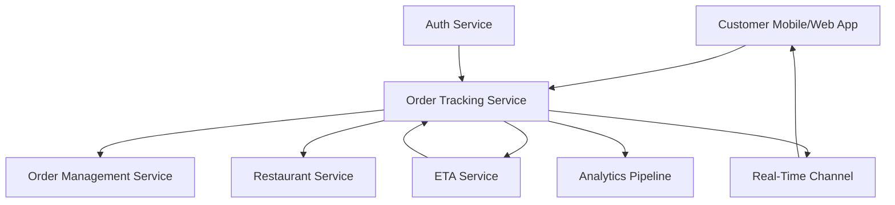

#### 1. High-Level Design

- **Summary**: This epic provides customers with a real-time view of their food order status from confirmation through delivery, including visual progress timeline, ETA calculation, and automatic status updates without page refresh. It ensures reliable status tracking even with duplicate or out-of-order events.

- **Component Flow**:

- **Integration Points**: 
  - Order management service (for order state and transitions)
  - Restaurant service (for preparation and ready events)
  - ETA service (for delivery-time estimation and updates)
  - Real-time channel (WebSocket/SSE for live updates)
  - Analytics pipeline (for tracking metrics)
  - Authentication/authorization service (for access control)

- **Key Assumptions**: 
  - Status events arrive via event stream with timestamps for ordering and deduplication
  - ETA calculations are provided by a separate service with refresh intervals of 2-5 minutes

- **NFR Highlights**: Must handle duplicate, delayed, and out-of-order events safely; support high concurrent traffic during peak periods; tracking screen must load quickly with non-blocking map loading; customers can only access their own orders

- **Data Flow**: Customer accesses tracking page → Auth Service validates session/account → Order Tracking Service retrieves current order state from Order Management Service → Restaurant Service provides preparation status → ETA Service calculates and returns estimated delivery time → Status timeline rendered with visual indicators → Real-time channel establishes WebSocket/SSE connection → Status updates pushed automatically as events occur (order confirmed, preparing, ready, picked up, delivered) → State transitions validated and persisted → Analytics Pipeline captures tracking events for operational insights

#### 2. Validation Report

- **Requirements Coverage**: The design fully addresses all requirements including real-time status display, progress timeline visualization, ETA calculation, live updates without refresh, state persistence, failure handling with last known data, status transition validation, and completed/cancelled order states. Security and accessibility requirements are incorporated through auth service integration and assistive technology support.