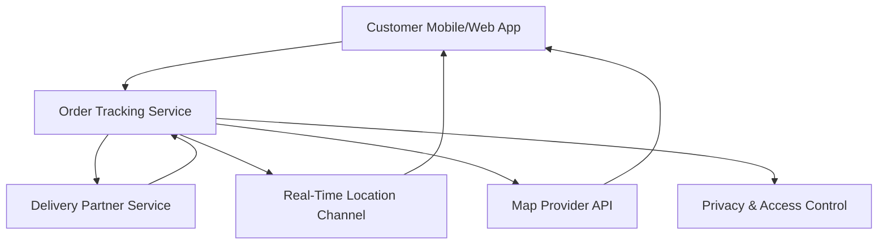

#### 1. High-Level Design

- **Summary**: This epic enables customers to view delivery partner information (name, photo) and track their real-time location on a map after order pickup. It provides transparency into delivery progress while maintaining privacy compliance and handling scenarios where location data may be unavailable.

- **Component Flow**:

- **Integration Points**: 
  - Delivery-partner service (for assignment, pickup events, and location updates)
  - Map provider (for location rendering and route display)
  - Real-time channel (WebSocket/SSE for live location updates)
  - Privacy and retention compliance systems (for data protection)

- **Key Assumptions**: 
  - Location updates are received at intervals of 10-30 seconds from delivery partners
  - Partner profile data (name, photo) is pre-validated and approved before display

- **NFR Highlights**: Must support high concurrent tracking traffic during peak periods; location data must follow privacy and retention rules; map loading should not block core status display

- **Data Flow**: Customer requests tracking view → Order Tracking Service retrieves partner assignment from Delivery Partner Service → Partner details (name, photo, contact) displayed to customer → Real-time location updates stream through WebSocket/SSE channel → Map Provider renders location and route → Updates pushed to customer app at regular intervals → Privacy controls filter sensitive data before transmission

#### 2. Validation Report

- **Requirements Coverage**: The design covers all stated requirements including partner assignment display, live location tracking, map rendering, privacy-compliant data handling, and graceful degradation when location is unavailable. The architecture supports high concurrency and ensures map loading doesn't block core functionality.