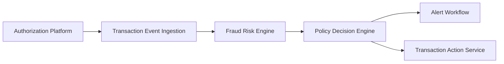

#### 1. High-Level Design

- **Summary**: This epic delivers the core fraud detection engine that ingests credit card transaction events in near real-time, evaluates risk using a fraud-risk scoring engine, and applies configurable thresholds to classify transactions as low, medium, or high risk. The system processes multiple fraud signals (unusual amounts, merchant behavior, geographic anomalies, velocity patterns, compromised-card indicators) and routes decisions to downstream alert and transaction-action workflows. It ensures idempotent processing to prevent duplicate fraud cases and implements fail-safe policies when the risk engine is unavailable.

- **Component Flow**:

- **Integration Points**: 
  - **Upstream**: Card authorization/transaction platform (transaction event source)
  - **Core**: Fraud-risk engine/model for risk scoring
  - **Decision**: Policy/decision engine for mapping risk scores to actions
  - **Downstream**: Analytics and audit infrastructure for event capture
  - **Governance**: Security and compliance stakeholders for policy approval

- **Key Assumptions**: 
  - Transaction events arrive in a standard JSON/Avro format with required fields (card ID, amount, merchant, location, timestamp)
  - Risk engine responds within sub-second latency; fail-safe defaults to medium-risk classification when unavailable

- **NFR Highlights**: Near-real-time processing SLA for risk evaluation and alert triggering; high availability with disaster recovery; support for transaction spikes without alert delays; idempotency and event versioning; strong encryption, secrets management, and least privilege access; comprehensive observability with metrics, logs, and traces

#### 2. Validation Report

- **Requirements Coverage**: The design addresses all stated scope elements including transaction ingestion, risk scoring, threshold management, decision routing, idempotency, and fail-safe handling. The component flow demonstrates clear separation between ingestion, evaluation, decision, and action layers, supporting the low/medium/high-risk classification workflow.

- **Traceability**: All scope items are mapped to architectural components: ingestion service handles events from authorization platform, fraud-risk engine evaluates signals, policy engine applies thresholds and routes decisions, and downstream services consume risk classifications.

- **Completeness**: The design covers functional requirements (risk scoring, threshold configuration, idempotency) and non-functional requirements (near-real-time SLA, high availability, encryption, observability). Integration points with upstream transaction platform, risk engine, policy engine, and downstream analytics are identified.

- **Gaps/Risks**: 
  - Specific SLA targets (e.g., P95 latency) not defined in epic; requires clarification during detailed design
  - Fail-safe policy details (default risk level, retry strategy) need specification
  - Idempotency key strategy (transaction ID, event ID, composite key) requires definition