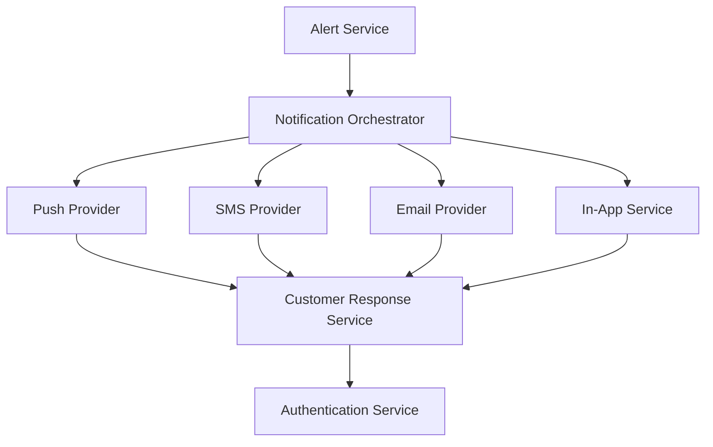

#### 1. High-Level Design

- **Summary**: This epic delivers the customer-facing fraud alert notification system that sends multi-channel alerts (push, SMS, email, in-app) for suspicious transactions and captures customer responses. Alerts present transaction details (amount, merchant, timestamp, location, masked card) with plain-language risk messaging. Customers authenticate and respond with confirmation ('Yes, this was me') or report ('No, I don't recognize this') actions. The system tracks alert lifecycle states (queued, delivered, viewed, confirmed, reported, protected, resolved, expired), respects notification preferences with security overrides, implements fallback channels, and groups alerts to prevent fatigue.

- **Component Flow**:

- **Integration Points**: 
  - **Notification Delivery**: Push, SMS, and email notification providers (third-party services)
  - **Security**: Customer identity/authentication service for secure response actions
  - **Data**: Alert service for canonical alert record creation and state management
  - **Recording**: Customer response service for capturing and persisting decisions
  - **Analytics**: Analytics infrastructure for tracking delivery success, view rates, and response events

- **Key Assumptions**: 
  - Notification providers support webhook callbacks for delivery/view status tracking
  - Customer preferences are stored in a centralized profile service; security overrides apply to high-risk transactions regardless of opt-out settings

- **NFR Highlights**: Near-real-time alert delivery SLA from transaction event to customer notification; delivery success tracked by channel and provider; cross-platform accessibility; strong authentication before fraud-response actions; secure notification links with rate-limiting; no full card numbers in notifications; encryption in transit and at rest

#### 2. Validation Report

- **Requirements Coverage**: The design addresses all scope elements including multi-channel delivery with fallbacks, transaction detail presentation, customer confirmation and report actions, alert state management, notification preferences with overrides, alert grouping, and delivery tracking. The component flow demonstrates orchestration across multiple notification channels with authentication-gated response handling.

- **Traceability**: All scope items mapped to components: notification orchestrator handles channel selection and fallback logic, provider integrations deliver alerts, customer response service captures actions, authentication service secures sensitive operations, and alert service maintains lifecycle state.

- **Completeness**: The design covers functional requirements (multi-channel delivery, customer actions, state tracking, grouping) and non-functional requirements (near-real-time delivery, authentication, secure links, data encryption, no full card numbers). Integration points with notification providers, authentication service, alert service, and analytics are identified.

- **Gaps/Risks**: 
  - Alert grouping logic (time window, transaction count threshold) requires specification
  - Fallback channel priority and retry intervals not defined in epic
  - Offline scenario handling (e.g., push notification when device offline) needs detailed design
  - Rate-limiting thresholds for notification links require definition to prevent abuse