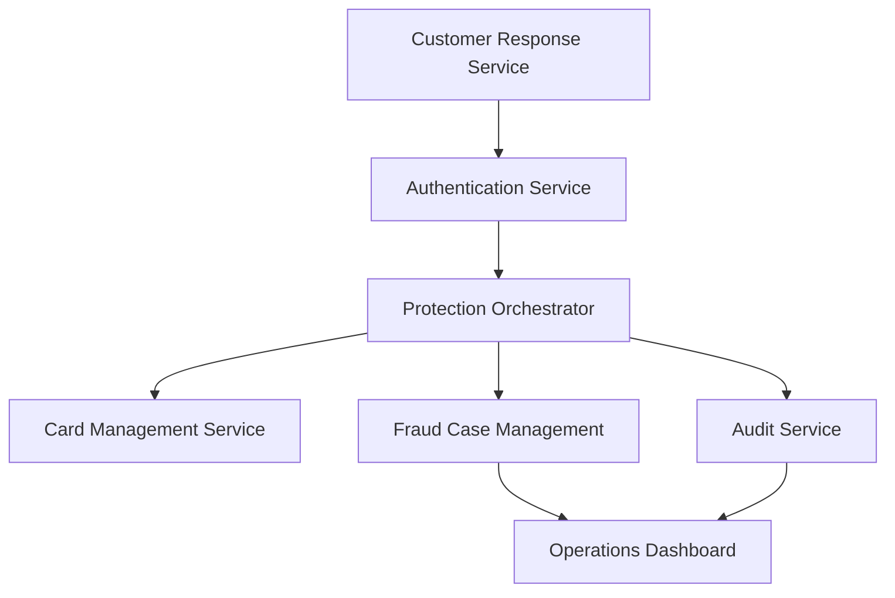

#### 1. High-Level Design

- **Summary**: This epic implements security workflows triggered when customers report unauthorized transactions, including immediate card/account protection actions, fraud case creation, investigation support, and dispute initiation. When a customer selects 'No, I don't recognize this', the system authenticates the action, triggers card-blocking or replacement workflows, creates fraud cases with appropriate severity, and provides fraud operations analysts with investigation visibility. The system maintains comprehensive audit trails for all lifecycle events, handles edge cases (confirm-after-block, multiple suspicious transactions, compromised accounts requiring step-up authentication), and enforces least-privilege access and retention policies.

- **Component Flow**:

- **Integration Points**: 
  - **Card Protection**: Card-management/protection service for blocking and replacement workflows
  - **Investigation**: Fraud case-management system for investigation and dispute workflows
  - **Security**: Customer identity/authentication service for step-up verification on compromised accounts
  - **Audit**: Audit infrastructure for durable lifecycle event retention
  - **Governance**: Security, legal, compliance stakeholders for policy enforcement
  - **Support**: Customer-support systems for dispute handling

- **Key Assumptions**: 
  - Card-management service supports synchronous blocking API with confirmation; replacement workflows may be asynchronous
  - Fraud case severity is derived from risk score and customer action; high-risk unauthorized reports trigger immediate blocking

- **NFR Highlights**: Complete unauthorized-report protection workflows within target operational SLA; minimize time to protection from unauthorized report; high availability for security-critical protection services; least-privilege access to fraud and customer data; security event logging without storing unnecessary sensitive payment data; all fraud-alert decisions auditable with durable records; zero critical security or privacy defects before GA

#### 2. Validation Report

- **Requirements Coverage**: The design addresses all scope elements including unauthorized transaction reporting workflow, card/account blocking triggers, fraud case creation, investigation and dispute pathways, audit trail recording, operations visibility, step-up authentication, protection workflow tracking, security event logging, and retention policy enforcement. The component flow demonstrates orchestration of protection actions with comprehensive audit capture.

- **Traceability**: All scope items mapped to components: customer response service initiates unauthorized reports, authentication service validates identity with step-up when needed, protection orchestrator coordinates blocking/replacement, card management service executes protection actions, fraud case management creates investigation records, audit service captures all events, and operations dashboard provides analyst visibility.

- **Completeness**: The design covers functional requirements (reporting workflow, protection triggers, case creation, investigation support, audit trails, operations visibility) and non-functional requirements (operational SLA, time to protection, high availability, least-privilege access, security logging, auditability, zero critical defects). Integration points with card management, fraud case management, authentication, audit, governance stakeholders, and customer support are identified.

- **Gaps/Risks**: 
  - Target operational SLA for protection workflow completion not quantified in epic
  - Edge case handling logic (confirm-after-block, multiple transactions) requires detailed workflow specification
  - Data retention periods for audit trails need definition per regulatory requirements
  - Step-up authentication triggers (compromised account indicators) require specification