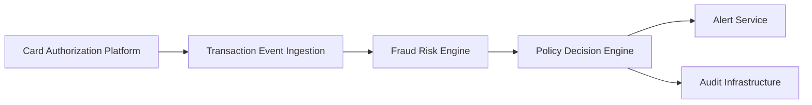

#### 1. High-Level Design

**Summary:** This epic implements a real-time fraud detection system that ingests credit card transaction events, evaluates risk using a fraud-risk engine, and triggers alerts based on configurable thresholds. The system analyzes multiple risk signals (transaction amount, geography, merchant behavior, velocity, device risk) to produce risk scores and categorize transactions into low, medium, high, and confirmed fraud levels, enabling rapid intervention to prevent unauthorized transaction losses.

**Component Flow:**

**Integration Points:**
- **Upstream Systems:**
  - Card authorization/transaction platform (source of transaction events)
  - Fraud-risk engine/model (provides risk scoring capability)
  - Policy/decision engine (threshold mapping and action determination)
- **Downstream Systems:**
  - Alert Service (receives alert triggers for customer notification)
  - Analytics and audit infrastructure (event capture and compliance logging)
  - Security infrastructure (encryption and secrets management)

**Key Assumptions:**
- Transaction events arrive in a standardized format (e.g., JSON/Avro) with required fields for risk evaluation (amount, merchant ID, location, device fingerprint, timestamp)
- The fraud-risk engine exposes a synchronous or near-synchronous API with response times compatible with the near-real-time SLA requirement

**NFR Highlights:** Risk evaluation and alert triggering must meet agreed transaction-time SLA for near-real-time processing; system must support transaction spikes without unacceptable alert delays; high availability required for security-critical services with defined disaster recovery; idempotency, retries, event versioning, and durable audit records required; metrics, logs, traces for model performance monitoring and drift detection.

**Data Flow:** 
Transaction events flow from the Card Authorization Platform to the Transaction Event Ingestion component, which validates and deduplicates events using idempotency keys. Each transaction is then passed to the Fraud Risk Engine, which analyzes risk signals (amount anomalies, geographic inconsistencies, merchant reputation, velocity patterns, device risk) and returns a risk score. The Policy Decision Engine receives the risk score, applies configurable thresholds, and categorizes the transaction into risk levels (low/medium/high/confirmed fraud). For transactions exceeding alert thresholds, the engine triggers the Alert Service to initiate customer notifications. All risk decisions and actions are logged to the Audit Infrastructure for compliance, investigation, and model performance monitoring.

#### 2. Validation Report

**Requirements Coverage:** 
The high-level design addresses all core requirements specified in the epic:
- ✅ Real-time transaction event ingestion from authorization platform
- ✅ Risk score evaluation using fraud-risk engine with multiple signal analysis
- ✅ Configurable alert threshold determination via policy/decision engine
- ✅ Risk decision model implementation (low/medium/high/confirmed fraud categorization)
- ✅ Idempotency handling for duplicate events
- ✅ Fail-safe policy for risk engine unavailability (implicit in architecture with fallback logic)
- ✅ Audit trail recording for all risk decisions
- ✅ NFR compliance: near-real-time SLA, high availability, scalability for transaction spikes, monitoring and observability

The design provides clear separation of concerns with dedicated components for ingestion, risk evaluation, policy decision, and alerting. Integration points with all specified dependencies are identified. The architecture supports the stated user value of reducing unauthorized transaction losses through rapid detection while minimizing false positives.

**Validation Summary:** The proposed HLD is complete and aligned with the epic's scope, dependencies, and non-functional requirements. It provides a scalable, auditable foundation for real-time fraud detection that can be extended in future epics for customer notification and account protection workflows.