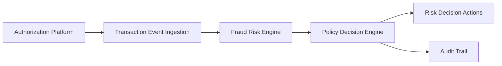

#### 1. High-Level Design

**Summary:** This epic delivers the core real-time fraud detection capability that ingests credit card transaction events from the authorization platform, evaluates risk using a fraud-risk engine with multiple signals (amount anomalies, merchant behavior, geographic inconsistencies, velocity patterns, compromised-card indicators), and determines transaction treatment (approve, alert, hold, decline) based on configurable thresholds and risk levels (low, medium, high, confirmed fraud).

**Component Flow:**

**Integration Points:**
- **Upstream:** Card authorization/transaction platform (transaction events)
- **Core:** Fraud-risk engine/model (risk scoring), Policy/decision engine (risk-to-action mapping)
- **Downstream:** Analytics monitoring and audit infrastructure, Security legal compliance stakeholders

**Key Assumptions:**
- Transaction events arrive in a standard event format with required fields for risk evaluation; risk engine responds within transaction-time SLA constraints.
- Configurable thresholds are managed through administrative interface with version control and audit trail.

**NFR Highlights:** Risk evaluation must meet agreed transaction-time SLA; support transaction spikes without unacceptable delays; high availability with disaster recovery; encryption in transit and at rest; least privilege access; idempotency and durable audit records.

#### 2. Validation Report

**Requirements Coverage:** The design covers all stated scope including transaction ingestion, risk evaluation, threshold management, decision mapping, policy routing, multiple risk signals, idempotency, fail-safe execution, audit trail, and model version tracking. NFRs address performance, availability, security, and observability requirements.

**Traceability:** Epic scope maps directly to component flow: ingestion → risk scoring → policy decision → action determination with audit logging throughout.

**Gap Analysis:** No critical gaps identified. Epic clearly defines scope boundaries excluding ML model development and cross-product fraud detection.

**Compliance & Security Validation:** Strong security controls specified including least privilege access, encryption at rest and in transit, audit trails, and data protection for fraud and customer data. Meets enterprise security standards for financial transaction processing.