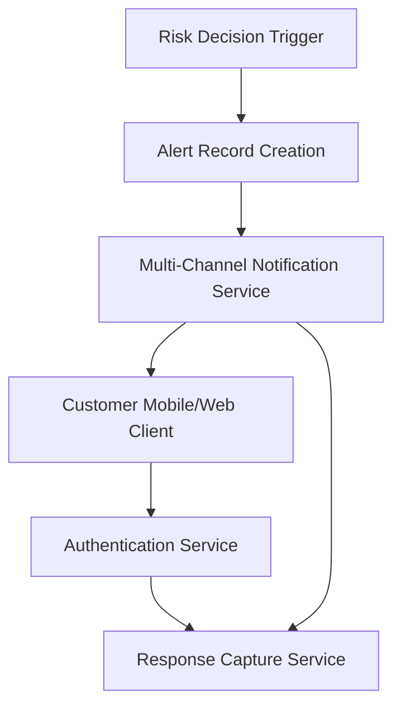

#### 1. High-Level Design

**Summary:** This epic delivers the customer-facing fraud alert notification and response capture system. When a transaction crosses the alert threshold, the system creates an alert record and delivers multi-channel notifications (push, SMS, email, in-app) with transaction context (amount, merchant, time, location, masked card). Customers can confirm legitimate transactions or report unrecognized ones. The system manages alert lifecycle states, handles delivery failures with fallback channels and retry logic, and respects customer preferences while enforcing security policy overrides.

**Component Flow:**

**Integration Points:**
- **Upstream:** Risk decision output from fraud detection epic (alert triggers)
- **Core:** Customer identity/authentication service (response validation), Notification providers (push, SMS, email delivery)
- **Downstream:** Card-management/protection service (unauthorized transaction workflows), Analytics and audit infrastructure, Customer-support systems

**Key Assumptions:**
- Customer contact information (push tokens, phone numbers, email addresses) is available and current in customer profile system.
- Notification delivery SLA assumes third-party provider availability meets near-real-time requirements with fallback channel support.

**NFR Highlights:** Alert delivery must meet near-real-time SLA from transaction event to customer notification; strong authentication before sensitive actions; rate-limiting for abuse prevention; never display full card numbers; accessibility across platforms; delivery success tracking by channel.

#### 2. Validation Report

**Requirements Coverage:** Design addresses all scope elements including alert creation, multi-channel delivery, transaction context presentation, customer actions (confirm/report), authenticated response capture, status tracking, fallback channels, preference handling with security overrides, expiration management, duplicate prevention, and accessibility.

**Traceability:** Component flow traces from alert trigger through notification delivery to authenticated customer response capture with proper state management throughout the alert lifecycle.

**Gap Analysis:** No critical gaps. Epic explicitly excludes time tracking for actions, international regulatory workflows, and third-party integrations, maintaining clear boundaries.

**Compliance & Security Validation:** Strong authentication and authorization controls specified; notification links protected from unauthorized access; rate-limiting for abuse prevention; minimal sensitive data exposure per privacy policy; no full card numbers in notifications. Meets PCI-DSS and privacy compliance requirements for customer notification systems.