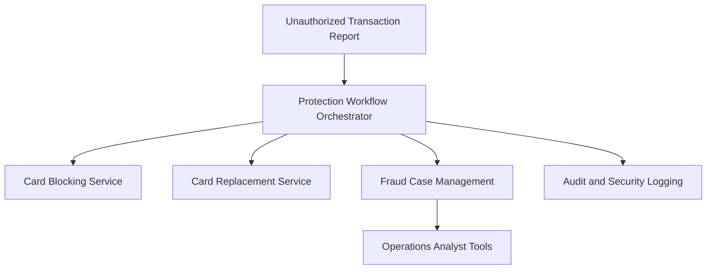

#### 1. High-Level Design

**Summary:** This epic implements critical security workflows triggered when customers report unauthorized transactions. Upon receiving an "I don't recognize this" response, the system immediately initiates card and account protection workflows including card blocking, card replacement triggering, and fraud case creation for investigation and dispute. The system manages fraud case states, provides fraud operations analyst tools for investigation, maintains comprehensive audit trails, enforces step-up authentication for compromised accounts, and applies legal/security-approved data retention policies.

**Component Flow:**

**Integration Points:**
- **Upstream:** Customer alert response (unauthorized transaction reports from notification epic)
- **Core:** Card-management/protection service (blocking and replacement), Fraud case-management system (investigation and disputes), Customer identity/authentication service (step-up authentication)
- **Downstream:** Analytics monitoring and audit infrastructure, Customer-support systems (fraud victim assistance), Security legal compliance teams

**Key Assumptions:**
- Card blocking and replacement services provide synchronous or near-synchronous confirmation of protection action completion within operational SLA.
- Fraud case-management system accepts case creation via API and supports required workflow states for investigation tracking.

**NFR Highlights:** Complete unauthorized-report protection workflows within target operational SLA; zero critical security or privacy defects before GA; strong authentication, authorization, encryption, secrets management, and least privilege; legal/security-approved retention policies; high availability with disaster recovery; operational dashboards for workflow success rates.

#### 2. Validation Report

**Requirements Coverage:** Design covers all scope including unauthorized report processing, card blocking and replacement workflows, fraud case creation and management, protection action tracking, investigation paths, analyst tools, security workflow state management, audit trails, authentication/authorization, step-up authentication, security event logging, data retention, and fraud operations monitoring.

**Traceability:** Workflow orchestrator ensures all protection actions (card blocking, replacement, case creation) are triggered and tracked from unauthorized report through completion with full audit trail and analyst visibility.

**Gap Analysis:** No critical gaps identified. Epic clearly excludes full case-management redesign, legal liability determination, dispute resolution automation, and chargeback integration, maintaining appropriate scope boundaries for this release.

**Compliance & Security Validation:** Comprehensive security controls including strong authentication, step-up authentication for compromised accounts, encryption, secrets management, least privilege access, security event logging without unnecessary sensitive data storage, and legal/security-approved retention policies. High availability and disaster recovery requirements ensure business continuity for security-critical services. Meets enterprise security, compliance, and operational resilience standards for fraud response systems.