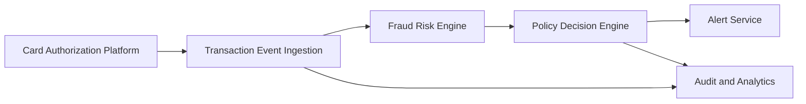

#### 1. High-Level Design

- **Summary**: This epic delivers real-time fraud detection capabilities that ingest credit card transaction events from the authorization platform, evaluate risk using a fraud-risk engine with multiple signals (unusual amounts, geographic inconsistencies, velocity patterns, compromised-card indicators), and apply configurable thresholds to determine actions (approve, alert, step-up verification, hold, or decline). The system provides near-real-time risk scoring to protect customers from unauthorized transactions while minimizing friction for legitimate purchases.

- **Component Flow**:

- **Integration Points**: 
  - **Upstream**: Card authorization/transaction platform (transaction event source)
  - **Core**: Fraud-risk engine/model for risk scoring, Policy/decision engine for threshold-based actions
  - **Downstream**: Alert service (for triggering customer notifications), Analytics and audit infrastructure for event capture and monitoring
  - **Governance**: Security and compliance stakeholders for policy approval

- **Key Assumptions**: 
  - Transaction events arrive in a standard format with required fields (amount, merchant, location, timestamp, card identifier)
  - Fraud-risk engine provides risk scores as numeric values that can be compared against configurable thresholds

- **NFR Highlights**: Near-real-time processing SLA for risk evaluation and alert triggering; High availability with disaster recovery for security-critical services; Support transaction spikes without unacceptable alert delays; Idempotency, retries, event versioning, and durable audit records

- **Data Flow**: Transaction events flow from the card authorization platform into the transaction event ingestion component, which validates and deduplicates events using idempotency handling. Events are passed to the fraud-risk engine, which calculates risk scores by evaluating multiple signals (transaction amount, merchant category, geographic/device inconsistency, velocity patterns, failed authorization attempts, compromised-card indicators). The risk score and transaction context are sent to the policy decision engine, which applies configurable thresholds to map risk levels to actions (approve, alert, step-up verification, hold, decline). High-risk decisions trigger alert creation in the alert service for customer notification. All events, risk scores, decisions, and actions are captured in the audit and analytics infrastructure for monitoring, compliance, and model performance tracking.

#### 2. Validation Report

- **Requirements Coverage**: The design covers all stated scope elements including transaction event ingestion, risk score calculation, configurable threshold management, risk decision mapping, policy engine integration, idempotency handling, risk signal evaluation (amount, merchant category, geographic/device inconsistency, velocity, failed attempts, compromised-card indicators), and fail-safe policy execution. The architecture supports the NFRs for near-real-time processing, high availability, transaction spike handling, and operational monitoring. All identified dependencies (authorization platform, fraud-risk engine, policy engine, analytics infrastructure, security/compliance stakeholders) are incorporated into the integration points.