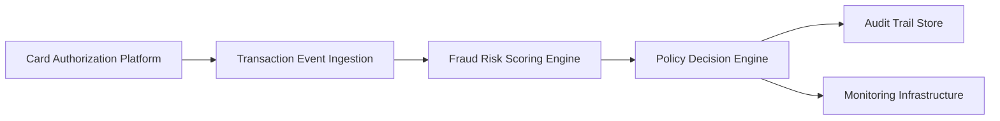

#### 1. High-Level Design

**Summary:** This epic delivers the core fraud detection engine that ingests credit card transaction events in near real-time, evaluates them against a risk scoring model using multiple fraud signals (unusual amounts, geographic inconsistencies, velocity patterns, compromised card indicators), and produces risk-based decisions (low/medium/high) according to configurable thresholds. The system ensures idempotent processing to avoid duplicate evaluations and implements fail-safe policies when the risk engine is unavailable.

**Component Flow:**

**Integration Points:**
- **Upstream:** Card authorization/transaction platform (transaction event source)
- **Core:** Fraud-risk engine/model for risk scoring
- **Core:** Policy/decision engine for threshold-based alert determination
- **Downstream:** Analytics and audit infrastructure for event capture
- **Downstream:** Monitoring infrastructure for operational visibility and model performance tracking

**Key Assumptions:**
- Transaction events arrive in a standardized format (e.g., JSON/Avro) with required fields for risk evaluation (amount, merchant, location, timestamp, card identifier).
- Risk scoring engine exposes a synchronous or near-synchronous API with response times compatible with transaction-time SLA requirements.

**NFR Highlights:** Near-real-time processing within transaction-time SLA; support for transaction spikes without unacceptable delays; high availability with disaster recovery; idempotency, retries, event versioning, durable audit records; metrics, logs, and traces for model performance and drift monitoring.

#### 2. Validation Report

**Requirements Coverage:** The design covers all stated scope elements including transaction ingestion, risk scoring, configurable thresholds, multi-level risk decisions, risk signal processing, idempotency, fail-safe policies, and audit trails. Integration points align with dependencies. NFRs for performance, availability, reliability, and observability are explicitly addressed.

**Traceability:** Epic scope maps directly to components: ingestion (Transaction Event Ingestion), scoring (Fraud Risk Scoring Engine), decision logic (Policy Decision Engine), audit (Audit Trail Store), and monitoring (Monitoring Infrastructure).

**Completeness:** All in-scope capabilities are represented. Out-of-scope items (ML model development, case management redesign, cross-product fraud, customer-facing explanations) are appropriately excluded from design.

**Risks & Gaps:**
- Risk engine unavailability handling requires clear fail-safe policy definition (allow/deny/manual review).
- Transaction spike capacity limits and auto-scaling policies need quantification.
- Model drift detection thresholds and alerting mechanisms require operational runbooks.