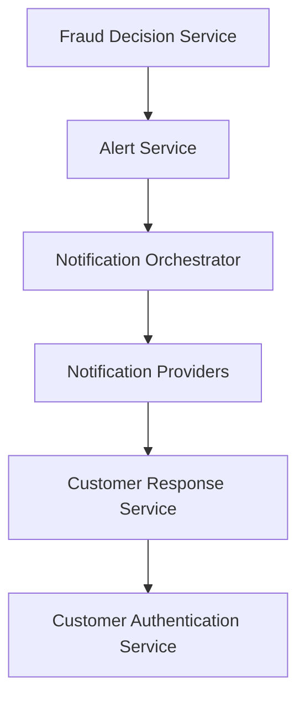

#### 1. High-Level Design

**Summary:** This epic provides the customer-facing fraud alert notification and response system that delivers multi-channel alerts (push, SMS, email, in-app) for suspicious transactions and enables customers to confirm legitimate activity or report unauthorized transactions. The system manages the full alert lifecycle (creation, delivery, viewing, confirmation, reporting, resolution, expiration), respects customer notification preferences with security policy overrides, implements fallback channels for delivery failures, and enforces authentication and authorization for all customer responses.

**Component Flow:**

**Integration Points:**
- **Upstream:** Fraud decision service (alert creation trigger based on risk score)
- **Core:** Alert service (canonical alert record and state management)
- **Core:** Customer identity/authentication service (response verification)
- **External:** Notification providers for push, SMS, and email delivery
- **Downstream:** Customer response service (action recording)
- **Downstream:** Analytics infrastructure (delivery and response tracking)

**Key Assumptions:**
- Notification providers support delivery status callbacks or polling for tracking success/failure.
- Customer notification preferences are stored in a centralized profile service accessible in near real-time.

**NFR Highlights:** Near-real-time alert delivery SLA from transaction event to customer notification; delivery success tracking by channel/provider; retry/fallback for provider unavailability; cross-platform accessibility; strong authentication and authorization; rate-limiting for abuse prevention; secure notification links.

#### 2. Validation Report

**Requirements Coverage:** The design covers all scope elements including multi-channel delivery, transaction context presentation, customer confirmation and reporting actions, alert state lifecycle, preference handling with security overrides, fallback channels, alert viewing, authentication/authorization, and delivery tracking with retry logic. All dependencies are represented in integration points.

**Traceability:** Epic scope maps to components: notification delivery (Notification Orchestrator, Notification Providers), alert state (Alert Service), customer actions (Customer Response Service), authentication (Customer Authentication Service).

**Completeness:** All in-scope capabilities are addressed. Out-of-scope items (time tracking, international expansion, chat integration, third-party monitoring) are excluded as specified.

**Risks & Gaps:**
- Fallback channel selection logic and retry policies require detailed specification (e.g., SMS fallback after push failure within X seconds).
- Rate-limiting thresholds for customer response endpoints need definition to balance security and legitimate use.
- Deep link security mechanisms (token expiration, single-use tokens) require detailed design.