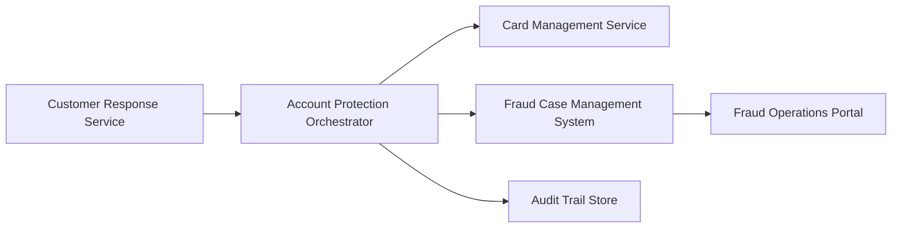

#### 1. High-Level Design

**Summary:** This epic implements security workflows activated when customers report unauthorized transactions, including card blocking, card replacement, fraud case creation and lifecycle management, comprehensive audit trails, and operational visibility for fraud analysts. The system executes protection workflows automatically based on customer reports within operational SLAs, enforces strong authentication and least-privilege access controls, implements secure data handling with encryption in transit and at rest, masks card numbers, and adheres to data retention and deletion policies.

**Component Flow:**

**Integration Points:**
- **Upstream:** Customer response service (unauthorized transaction report trigger)
- **Upstream:** Alert service (case-to-alert linking)
- **Core:** Customer identity/authentication service (step-up authentication for sensitive actions)
- **Core:** Card-management/protection service (card blocking and replacement)
- **Core:** Fraud case-management system (case tracking and investigation)
- **Downstream:** Analytics and audit infrastructure (security event capture)
- **Downstream:** Customer-support systems (dispute handling)
- **Governance:** Security, legal, compliance stakeholders (policy enforcement)

**Key Assumptions:**
- Card blocking actions are executed synchronously or with immediate effect to minimize fraud window.
- Fraud case management system supports API-driven case creation and status updates for automated workflows.

**NFR Highlights:** Complete unauthorized-report protection workflows within target operational SLA; minimize and measure time to protection; high availability for security-critical services; strong authentication, authorization, encryption, secrets management, least privilege; never display full card numbers; approved retention and deletion policies; security event logging without storing unnecessary sensitive payment data; zero critical security or privacy defects before GA.

#### 2. Validation Report

**Requirements Coverage:** The design covers all scope elements including unauthorized transaction reporting workflow, card blocking and account protection triggers, card replacement initiation, fraud case lifecycle management, protection action tracking, audit trail retention, fraud analyst operations visibility, security event logging, dispute pathways, authentication/authorization, secure data handling with encryption, masked card display, and data retention/deletion enforcement. All dependencies and NFRs are addressed.

**Traceability:** Epic scope maps to components: reporting workflow (Customer Response Service), protection orchestration (Account Protection Orchestrator), card actions (Card Management Service), case management (Fraud Case Management System), audit (Audit Trail Store), operations (Fraud Operations Portal).

**Completeness:** All in-scope capabilities are represented. Out-of-scope items (full case management redesign, legal advice, dispute resolution decisions, chargeback automation, cross-product fraud) are appropriately excluded.

**Risks & Gaps:**
- Operational SLA targets for protection workflow completion require quantification (e.g., card block within 30 seconds of unauthorized report).
- Step-up authentication requirements and triggers need detailed specification (e.g., biometric, OTP, security questions).
- Data retention periods and deletion automation mechanisms require alignment with legal/compliance policies.
- Fraud analyst access controls and audit logging for sensitive data access require detailed RBAC design.