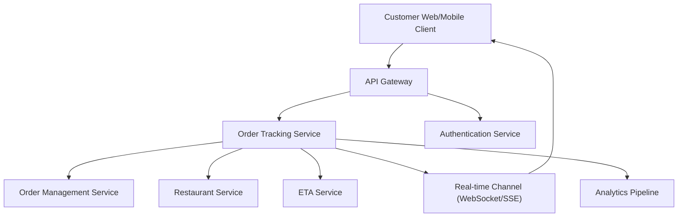

#### 1. High-Level Design

- **Summary:** This epic delivers a real-time order tracking interface that displays order status, fulfillment stage progression, and estimated delivery time. The system provides a visual timeline from order confirmation through delivery with automatic updates via push technology, handling edge cases like delayed acceptance and network issues through state persistence and recovery mechanisms.

- **Component Flow:**

- **Integration Points:**
  - **Upstream:** Order Management Service (order state source of truth), Restaurant Service (preparation/ready events), ETA Service (delivery time estimation), Authentication/Authorization Service (access control)
  - **Real-time:** WebSocket/SSE channel for live status updates
  - **Downstream:** Analytics pipeline for product and operational metrics

- **Key Assumptions:**
  - Order state events arrive in JSON format with timestamps for deduplication and ordering logic
  - Status refresh frequency is configurable per deployment environment to balance real-time accuracy with infrastructure cost

- **NFR Highlights:** Fast initial load with non-blocking map rendering; high concurrent traffic support during peak periods; low-latency updates; event deduplication using timestamps/versioning; account/session-based access control

#### 2. Validation Report

- **Requirements Coverage:** The design addresses all stated scope items including order status display, timeline visualization, ETA calculation, automatic refresh, state persistence, failure handling, status validation, and pending state management. The component architecture supports the required integrations with order management, restaurant, ETA, real-time channels, analytics, and authentication services.

- **NFR Compliance:** The design explicitly supports non-blocking map loading, high concurrent traffic handling, low-latency updates, event deduplication via timestamps/versioning, and account/session-based authorization as specified in the epic's NFRs.

- **Edge Case Handling:** The design accounts for delayed acceptance, missing partner assignments, network connectivity issues through state persistence and last known state display with recovery options.

- **Security & Compliance:** Access control enforced via authentication service ensures customers can only view orders associated with their account/session.