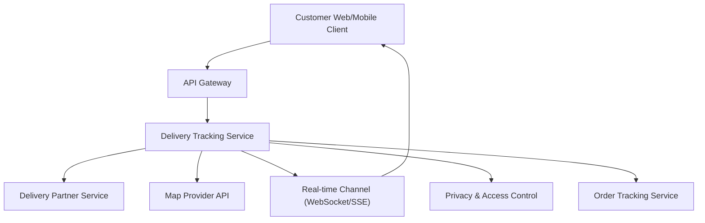

#### 1. High-Level Design

- **Summary:** This epic provides real-time delivery partner tracking with live location visualization on a map after order pickup. Customers view approved partner information (name, photo, contact options), see live location updates on an interactive map, and receive proximity alerts near delivery. The system gracefully degrades when location data is unavailable and enforces privacy controls on partner information exposure.

- **Component Flow:**

- **Integration Points:**
  - **Upstream:** Delivery Partner Service (assignment, pickup, location events), Map Provider (location and route rendering), Privacy and Access Control Systems (approved field filtering)
  - **Real-time:** WebSocket/SSE for live location updates
  - **Internal:** Order Tracking Service for order state correlation

- **Key Assumptions:**
  - Partner location updates arrive at 10-30 second intervals (configurable) to balance accuracy with system load
  - Map provider API supports standard lat/long coordinates and polyline route rendering

- **NFR Highlights:** Privacy and retention rules enforced on partner location data; approved-field-only exposure for partner information; non-blocking map loading; balanced location refresh frequency; no false location display when data unavailable

#### 2. Validation Report

- **Requirements Coverage:** The design covers all scope elements including partner assignment display, name/photo display, approved contact options, live map after pickup, location tracking, proximity alerts, graceful degradation without location data, and privacy-compliant information exposure.

- **NFR Compliance:** Privacy and retention rules are enforced through dedicated access control integration; sensitive partner information is filtered to approved fields only; map loading is non-blocking; location refresh frequency is configurable; system prevents misleading location display when data is unavailable.

- **Privacy & Security:** Privacy and access control systems enforce approved field exposure and data retention policies, ensuring compliance with partner privacy requirements.

- **Graceful Degradation:** When location data is unavailable, the system displays status and ETA without map markers, preventing customer confusion and maintaining trust.