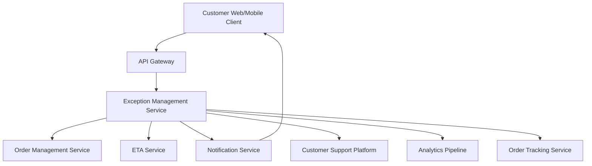

#### 1. High-Level Design

- **Summary:** This epic implements comprehensive exception handling and customer support integration for order tracking, managing delays, cancellations, material ETA changes, and other issues requiring customer attention. The system displays exception banners with clear explanations, shows revised ETAs, handles order cancellations with next steps, provides contextual support access, transitions delivered orders to completed state, exposes rating/review capabilities, and maintains order history.

- **Component Flow:**

- **Integration Points:**
  - **Upstream:** Order Management Service (cancellation events, state transitions), ETA Service (material change detection), Notification Service (push/SMS/email alerts), Customer Support Platform (contextual help routing)
  - **Downstream:** Analytics Pipeline (support contact rates, completion rates tracking)
  - **Internal:** Order Tracking Service for status correlation and history maintenance

- **Key Assumptions:**
  - Material ETA change threshold is defined as 15+ minutes deviation from original estimate (configurable per business rules)
  - State machine validation rules are maintained in Order Management Service and enforced via API contracts

- **NFR Highlights:** Material ETA changes trigger customer notifications; status changes accessible via assistive technologies; state transitions validated against allowed state machine; completed/cancelled orders remain in history but not active tracking; reliable exception handling during peak traffic

#### 2. Validation Report

- **Requirements Coverage:** The design addresses all scope items including delay detection/communication, material ETA change handling, cancellation display with next steps, exception banners, contextual support access, order completion transition, post-delivery rating/review exposure, and order history maintenance.

- **NFR Compliance:** Material ETA changes trigger notifications via Notification Service integration; accessibility support for assistive technologies is enforced at UI layer; state machine validation prevents invalid transitions; completed/cancelled orders are archived but accessible in history; system designed for peak traffic reliability.

- **Exception Handling:** Clear exception banners with explanations, revised ETA display, cancellation information with next steps, and contextual support access provide comprehensive customer communication during issues.

- **Customer Support Integration:** Contextual routing to Customer Support Platform reduces friction when customers need assistance, with analytics tracking support contact rates to measure effectiveness.