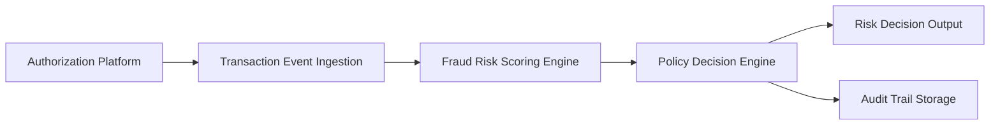

#### 1. High-Level Design

**Summary:** This epic implements a real-time fraud detection system that ingests credit card transaction events from the authorization platform, evaluates them using a risk scoring engine with multiple fraud signals (unusual amounts, geographic inconsistencies, merchant behavior, velocity patterns, compromised-card indicators), and classifies transactions into risk bands (low, medium, high, confirmed fraud) based on configurable thresholds. The system must operate with low latency to enable near-real-time intervention while maintaining high availability for security-critical operations.

**Component Flow:**

**Integration Points:**
- **Upstream Systems:**
  - Card authorization/transaction platform (source of transaction events)
  - Fraud-risk engine/model (provides risk scoring capabilities)
  - Policy/decision engine (maps risk scores to actions based on thresholds)
  
- **Downstream Systems:**
  - Analytics and audit infrastructure (receives event capture and audit trails)
  - Monitoring infrastructure (receives latency and performance metrics)
  - Downstream fraud alert and protection workflows (consumers of risk decisions)

**Key Assumptions:**
- Transaction events arrive in a standardized format (JSON/Avro) with required fields (amount, merchant, location, timestamp, card identifier).
- Risk scoring engine is available as a callable service/API with sub-second response times; fallback to fail-safe policy when unavailable.

**NFR Highlights:** Risk evaluation must meet agreed transaction-time SLA for near-real-time processing; high availability required for security-critical services with defined disaster recovery; support transaction spikes without unacceptable alert delays; provide metrics, logs, traces for model performance monitoring.

**Data Flow:** Transaction events are ingested from the authorization platform in near-real-time. The ingestion layer validates and deduplicates events (idempotency handling), then forwards them to the fraud risk scoring engine. The engine evaluates multiple fraud signals and returns a risk score. The policy decision engine receives the risk score, applies configurable thresholds, and classifies the transaction into a risk band (low/medium/high/confirmed fraud). Risk decisions are output to downstream alert and protection workflows, while all decisions and model versions are logged to the audit trail storage for compliance and monitoring. Performance metrics are continuously emitted to monitoring infrastructure.

#### 2. Validation Report

**Requirements Coverage:** The high-level design fully covers the epic's stated scope including transaction event ingestion, risk score calculation, risk band classification, configurable threshold management, policy engine integration, idempotency handling, audit trail creation, model version tracking, and fail-safe policy execution. All NFRs related to low-latency processing, high availability, transaction spike handling, idempotency, retries, event versioning, durable audit records, and monitoring capabilities are addressed in the architecture. The component flow demonstrates clear separation of concerns between ingestion, scoring, policy decision, and audit functions. Integration points with all specified dependencies (authorization platform, risk engine, policy engine, analytics infrastructure, monitoring infrastructure) are explicitly identified. The design supports the user value of reducing unauthorized transaction losses while minimizing false positives through configurable risk thresholds and policy-based decision making.