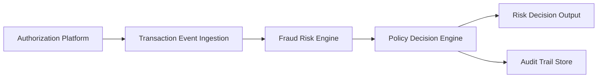

#### 1. High-Level Design

- **Summary**: This epic implements a real-time fraud detection system that ingests credit card transaction events from the authorization platform, evaluates them using a fraud-risk scoring engine with multiple signals (amount, merchant, geography, velocity, device), and produces risk decisions mapped to specific actions (approve, alert, step-up, hold, decline). The system categorizes transactions into risk levels (low, medium, high, confirmed fraud) with configurable thresholds and includes fail-safe policies, idempotency handling, and comprehensive audit trails.

- **Component Flow**:

- **Integration Points**: 
  - **Upstream**: Card authorization/transaction platform (source of transaction events)
  - **Downstream**: Fraud-risk engine/model for risk scoring, Policy/decision engine for action mapping, Analytics and audit infrastructure for event capture
  - **Stakeholders**: Security and compliance stakeholders for policy approval

- **Key Assumptions**: 
  - Transaction events arrive in a standardized format with all required risk signals (amount, merchant, geography, velocity, device data)
  - Risk scoring thresholds and action mappings are pre-configured and maintained by fraud operations teams with defined governance

- **NFR Highlights**: Risk evaluation and alert triggering must meet agreed transaction-time SLA; Support transaction spikes without unacceptable alert delays; High availability for security-critical services with defined disaster recovery; Idempotency, retries, event versioning, and durable audit records required; Metrics, logs, and traces for risk decision latency and error rates; Monitor model performance and drift indicators.

- **Data Flow**: Transaction events flow from the authorization platform to the ingestion layer, which validates and deduplicates events using idempotency keys. The fraud-risk engine consumes these events and calculates risk scores based on multiple signals (transaction amount, merchant behavior, geographic inconsistencies, velocity patterns, device risk indicators). Risk scores are passed to the policy decision engine, which applies configurable thresholds to map risk levels to specific actions (approve, alert, step-up, hold, decline). Risk decisions are output to downstream systems for execution while simultaneously being recorded in the audit trail store with model version tracking for compliance and investigation purposes.

#### 2. Validation Report

- **Requirements Coverage**: The design fully covers the epic's stated scope including transaction event ingestion, risk score evaluation, configurable threshold management, risk decision mapping, policy engine integration, idempotency handling, risk signal processing, fail-safe policies, audit trails, and model version tracking. All NFRs are addressed through the architecture: transaction-time SLA via real-time processing pipeline, spike handling through scalable ingestion, high availability via redundant services, and comprehensive observability through metrics/logs/traces. Dependencies on authorization platform, fraud-risk engine, policy engine, and audit infrastructure are explicitly incorporated into the component flow.