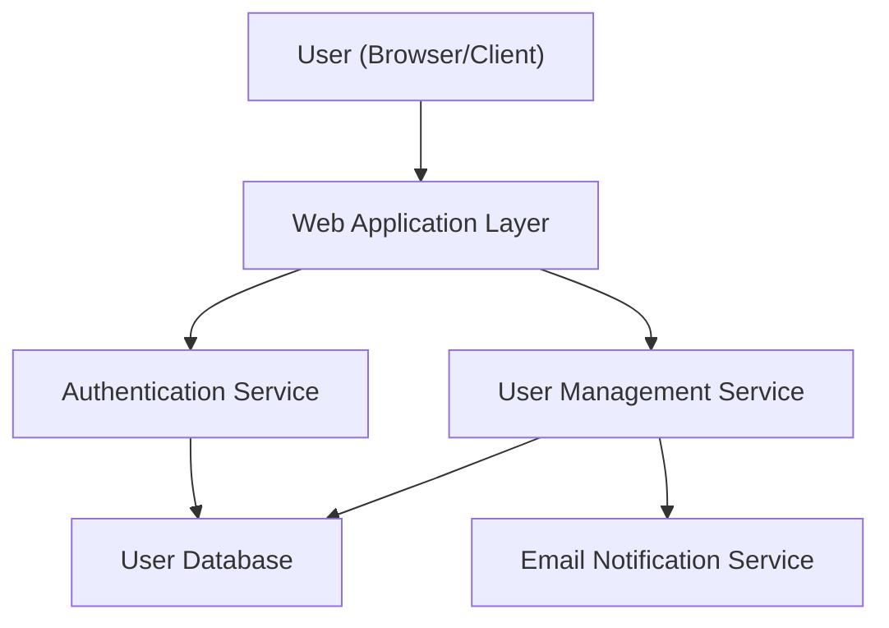

#### 1. High-Level Design

**Summary:** This epic delivers complete user lifecycle management for an online shopping platform, covering registration, authentication, and role-based access control (RBAC) for three user personas: consumers, sellers, and administrators. The system provides secure onboarding with email confirmation, login mechanisms, and role-appropriate access segregation to ensure platform integrity and data protection.

**Component Flow:**

**Integration Points:**
- **Email/SMS Notification Providers:** For sending registration confirmation emails, password reset links, and account-related notifications
- **Cloud Hosting Services:** For secure storage of user data with encryption at rest
- **Third-party Authentication Services:** Optional integration point if SSO or external identity providers are adopted in future

**Key Assumptions:**
- User registration will require email verification before account activation; email format follows standard SMTP protocols.
- Role assignment (buyer, seller, admin) occurs during registration or via admin approval workflow; default role is "buyer" unless seller verification is completed.

**NFR Highlights:** 99.9% uptime SLA; authentication response time under 1 second; encryption in transit (TLS) and at rest (AES-256); support for 100,000 concurrent users with horizontal scaling; compliance with regional data privacy laws (GDPR, CCPA); account lockout after 5 failed login attempts within 15 minutes.

**Data Flow:** 
1. **Registration:** User submits registration form → Web Application validates input → User Management Service creates user record with hashed password → Email Notification Service sends confirmation email → User clicks confirmation link → Account activated in User Database.
2. **Authentication:** User submits credentials → Authentication Service validates against User Database → JWT/session token issued → Role-based permissions loaded → User redirected to role-appropriate dashboard.
3. **Password Reset:** User requests reset → Authentication Service generates secure token → Email sent with reset link → User submits new password → Password hash updated in User Database.

#### 2. Validation Report

**Requirements Coverage:** 
The high-level design fully covers the epic's stated scope:
- ✅ User registration for buyers and sellers with email confirmation workflow
- ✅ Authentication and login with secure password handling
- ✅ Role-based access control for consumers, sellers, and administrators
- ✅ Account management and user profile management
- ✅ Password reset functionality
- ✅ All NFRs addressed: encryption, data privacy compliance, performance targets (1-second authentication, 100K concurrent users), 99.9% uptime, and account lockout for suspicious activity
- ✅ Dependencies identified: email/SMS providers, cloud hosting, optional third-party auth services
- ✅ Out-of-scope items clearly noted: social media login, biometric auth, custom identity provider, in-person verification

The design provides a scalable, secure foundation for user management across all platform personas, meeting both functional and non-functional requirements specified in the epic.