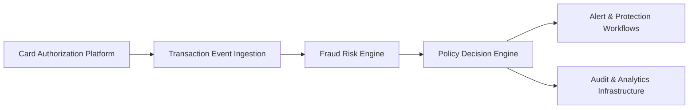

#### 1. High-Level Design

- **Summary**: This epic implements a real-time fraud detection capability that ingests credit card transaction events from the authorization platform, evaluates each transaction using a fraud-risk engine to produce risk scores, applies configurable thresholds to map transactions to risk bands (low, medium, high, confirmed fraud), and triggers downstream alert and protection workflows based on risk decisions. The system includes idempotency handling, fail-safe policies, and comprehensive audit trails.

- **Component Flow**:

- **Integration Points**: 
  - **Upstream**: Card authorization/transaction platform (source of transaction events)
  - **Downstream**: Fraud-risk engine/model for risk scoring, Policy/decision engine for mapping risk to actions, Alert and protection workflows (triggers customer notifications and account protection), Analytics and audit infrastructure for event capture

- **Key Assumptions**: 
  - Transaction events arrive in a standard format (e.g., JSON/Avro) with required fields (amount, merchant, timestamp, card identifier, location)
  - Risk engine returns scores in a normalized range (e.g., 0-100 or 0-1) with consistent response times

- **NFR Highlights**: Risk evaluation and alert triggering must meet agreed transaction-time SLA; Support transaction spikes without unacceptable alert delays; High availability for security-critical services with defined disaster recovery

- **Data Flow**: Transaction events flow from the card authorization platform to the ingestion layer, which validates and deduplicates events using idempotency keys. Each transaction is then sent to the fraud-risk engine for scoring. The risk score is passed to the policy/decision engine, which applies configurable thresholds to classify the transaction into a risk band (low, medium, high, confirmed fraud). Based on the risk decision, the system triggers appropriate downstream workflows (customer alerts for medium/high risk, immediate protection actions for confirmed fraud) and writes all decisions and scores to the audit and analytics infrastructure for compliance and operational monitoring.

#### 2. Validation Report

- **Requirements Coverage**: The design fully covers the epic's stated scope including transaction event ingestion, risk score evaluation, configurable threshold management, risk decision mapping, idempotency handling, fail-safe policy execution, and audit trail creation. All NFRs related to SLA, availability, scalability, and operational observability are addressed through the component architecture. Dependencies on the card authorization platform, fraud-risk engine, policy engine, and analytics infrastructure are explicitly mapped to integration points in the design.